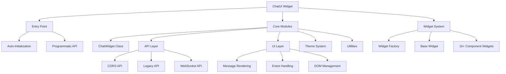

# ChatUI Widget Overview

ChatUI is a professional, **ultra-lightweight (~12KB)**, API-agnostic chat UI widget built with **pure Vanilla JavaScript**. Zero framework lock-in (no React/Vue/jQuery), zero external dependencies, with **CORS-first communication** and automatic JSONP fallback for seamless cross-domain integration.

## Strategic Position

ChatUI provides the interactive power of a modern conversational UI without the performance overhead or technical complexity of framework-bound libraries. It is designed to be "live in 30 seconds" while remaining extensible enough for complex enterprise requirements.

## Target Markets

- **SMBs**: Professional chat with zero dev overhead.
- **Enterprise Legacy Systems**: Modern interactivity without framework migrations.
- **SaaS Platforms**: A lean, white-label frontend for proprietary backends.

## Key Features

- **Ultra-Lightweight**: ~12KB core footprint, minimal impact on host performance.
- **Interactive Widget System**: Support for 15+ specialized UI components (Rating, Date Picker, File Upload, etc.).
- **Zero Dependencies**: Pure vanilla JS, works with any stack.
- **CORS-First Communication**: Modern fetch-based API with automatic JSONP fallback for legacy compatibility.
- **Real-Time WebSocket Support**: Live typing indicators, read receipts, and streaming responses.
- **Protocol-Based Transport**: Automatically uses WebSocket (ws/wss) or CORS/JSONP (http/https) based on server URL.
- **Dual Modes**: Supports both `popup` and `fullpage` embedded modes.
- **Modular Architecture**: Built with modern ES6 classes and a dedicated `WidgetFactory`.
- **Accessible & Secure**: ARIA-compliant focus management and robust XSS prevention.

## Quick Start

### 1. HTML Integration (Auto-initialize)
Add the script tag to your HTML. The widget will automatically initialize based on the data attributes.

**CORS Mode (HTTP/HTTPS) - Default:**
```html
<script 
  id="chat-widget"
  src="path/to/chat-widget.js"
  data-server-url="https://your-server.com"
  data-position="bottom-right"
  data-color="#007bff"
  data-title="Chat with us">
</script>
```

**JSONP Mode (Legacy Fallback):**
```html
<script 
  id="chat-widget"
  src="path/to/chat-widget.js"
  data-server-url="http://your-server.com"
  data-prefer-jsonp="true"
  data-position="bottom-right"
  data-color="#007bff"
  data-title="Chat with us">
</script>
```

**WebSocket Mode (WS/WSS):**
```html
<script 
  id="chat-widget"
  src="path/to/chat-widget.js"
  data-server-url="wss://your-server.com/ws"
  data-position="bottom-right"
  data-color="#007bff"
  data-title="Chat with us">
</script>
```

### 2. Programmatic API
You can initialize and control the widget manually using the global `ChatUI` object.

```javascript
// Initialize the widget
const chat = ChatUI.init({
  id: 'custom-chat',
  title: 'Support Chat',
  color: '#28a745',
  position: 'bottom-left',
  serverUrl: 'http://localhost:3000'
});

// Control the widget
chat.open();
chat.close();
chat.toggle();
chat.sendMessage('Hello from the API!');
```

## Architecture Overview



## Module Structure

The widget is organized into logical modules:

- **Entry Point**: Auto-initialization and global API
- **Core Classes**: Main ChatWidget implementation
- **API Layer**: Transport abstraction (CORS/JSONP/WebSocket)
- **UI Layer**: DOM manipulation and event handling
- **Theme System**: Styling and customization
- **Widget System**: Interactive component framework
- **Utilities**: Helper functions and shared utilities

## Communication Protocols

ChatUI supports multiple transport protocols with automatic fallback:

1. **WebSocket** (ws/wss): Real-time bidirectional communication
2. **CORS** (http/https): Modern fetch-based API calls
3. **JSONP** (http/https): Legacy fallback for older servers

## Configuration Options

| Attribute | JS Option | Description | Default |
|-----------|-----------|-------------|---------|
| `data-server-url` | `serverUrl` | Base URL for the chat backend API | `http://localhost:3000` |
| `data-display` | `displayMode` | Display mode: `popup` or `fullpage` | `popup` |
| `data-mode` | `themeMode` | Theme mode: `light` or `dark` | `light` |
| `data-position` | `position` | Corner position: `bottom-right`, `bottom-left`, `top-right`, `top-left` | `bottom-right` |
| `data-color` | `primaryColor` | Primary theme color (Hex code) | `#007bff` |
| `data-title` | `title` | Title text displayed in the header | `Chat with us` |
| `data-target` | `targetSelector` | Selector for container element (fullpage mode only) | `null` |
| `data-prefer-jsonp` | `preferJsonP` | Force JSONP instead of CORS (legacy) | `false` |
| `data-force-jsonp` | `forceJsonP` | Force JSONP only, no CORS fallback | `false` |
| `data-timeout` | `timeout` | CORS request timeout in milliseconds | `5000` |

## CSS Customization

The widget uses strictly ID-rooted CSS selectors to prevent affecting your site's styles. You can easily theme it by targeting its classes in your own CSS:

```css
/* Override the widget header color */
#chat-widget .header {
    background-color: #333;
    color: #fff;
}

/* Adjust message bubble styles */
#chat-widget .message {
    font-size: 16px;
}
```

## Widget Components

ChatUI includes 15+ interactive widget components:

### Input Widgets
- **Input Widget**: Text input with validation
- **Textarea Widget**: Multi-line text input
- **Password Widget**: Secure password input

### Selection Widgets
- **Select Widget**: Dropdown selection
- **Radio Widget**: Single selection radio buttons
- **Checkbox Widget**: Multiple selection checkboxes
- **Toggle Widget**: On/off toggle switch

### Interactive Widgets
- **Rating Widget**: Star rating component
- **Date Widget**: Date picker with validation
- **Color Picker Widget**: Color selection tool
- **Slider Widget**: Numeric range slider
- **Tags Widget**: Tag input and management

### Action Widgets
- **Button Widget**: Interactive buttons
- **Confirmation Widget**: Yes/No confirmation dialogs
- **File Upload Widget**: File upload with preview

### Display Widgets
- **Text Widget**: Static text display
- **Card Widget**: Content display cards
- **Progress Widget**: Progress indicators
- **Container Widget**: Generic containers

## API Integration

The widget supports multiple transport protocols with automatic fallback:

### CORS Mode (Default) - HTTP/HTTPS
The widget uses modern fetch API with proper CORS headers. This is the default and recommended approach for modern web applications.

#### Handshake
`POST /api/handshake`  
Request body: `{ type: 'handshake', timestamp: 1234567890 }`  
Response: `{ status: "success", session_key: "..." }`

#### Send/Receive Messages
`POST /api/messages`  
Request body: `{ type: 'message', message: "...", session_key: "...", timestamp: 1234567890 }`  
Response: `{ text: "Response message", sender: "bot" }`

### JSONP Mode (Legacy Fallback)
If CORS fails or is explicitly configured, the widget automatically falls back to JSONP for compatibility with older servers.

#### Handshake
`GET /api/handshake?callback=cb`  
Response: `{ status: "success", session_key: "..." }`

#### Send/Receive Messages
`GET /api/messages?callback=cb&message=...&session_key=...`  
Response: `{ text: "Response message", sender: "bot" }`

### WebSocket Mode (WS/WSS)
For real-time features, use a WebSocket endpoint. The widget will automatically detect the protocol and establish a WebSocket connection.

#### WebSocket Message Format
The widget sends and receives JSON messages with the following structure:

**Client → Server:**
```json
{
  "type": "handshake|connect|message|typing|read_receipt",
  "payload": { ... },
  "session_key": "...",
  "timestamp": 1234567890
}
```

**Server → Client:**
```json
{
  "type": "handshake|message|message:stream|typing|read_receipt",
  "text": "...",
  "widget": { ... },
  "payload": { ... },
  "session_key": "...",
  "timestamp": 1234567890
}
```

## Development

### Build
To build the distribution file (`dist/chat-widget.js`):
```bash
npm run build
```

### Testing
Run the Playwright end-to-end tests:
```bash
npm test
```

### Demo Server
To see the widget in action with a live backend:
```bash
npm run start:demo
```

Then open `demo/demo.html` in your browser.

## Security Features

- **CORS-First Security**: Uses modern CORS headers by default, falling back to JSONP only when necessary.
- **JSONP Security**: Callback validation to prevent XSS when JSONP fallback is used.
- **Scoped Reset**: Internal CSS reset prevents host styles from breaking the UI.
- **Message Sanitization**: Proper handling of user-generated content.
- **Timeout Protection**: Configurable request timeouts prevent hanging connections.

## Browser Support

- **Modern Browsers**: Chrome 60+, Firefox 55+, Safari 12+, Edge 79+
- **Legacy Support**: IE 11 with polyfills (limited functionality)
- **Mobile**: Full support for iOS Safari and Android Chrome
- **Touch**: Optimized for touch interactions

## Performance

- **Bundle Size**: ~12KB minified and gzipped
- **Runtime**: Minimal performance impact on host page
- **Memory**: Efficient memory management with proper cleanup
- **Network**: Intelligent transport selection and fallback

## Documentation Structure

This LiveWiki documentation includes:

- **Getting Started**: Quick setup and integration guides
- **Architecture**: System design and technical overview
- **API Reference**: Complete API documentation
- **Module Documentation**: Detailed documentation for all modules
- **Widget Components**: Documentation for all widget types
- **Development**: Development workflow and contribution guidelines
- **Troubleshooting**: Common issues and solutions
- **LLM Context**: AI-optimized documentation for LLM consumption

## See Also

- [Getting Started](getting_started.md) - Quick setup guide
- [Architecture](architecture.md) - Detailed system design
- [API Reference](api_reference.md) - Complete API documentation
- [Configuration](configuration.md) - All configuration options
- [Development](development.md) - Development workflow and guidelines
- [Table of Contents](table_of_contents.md) - Complete documentation index

---

**Version**: 1.0.0  
**Last Updated**: 2026-01-22  
**License**: MIT  
**Repository**: [GitHub](https://github.com/lesichkovm/chatui)
