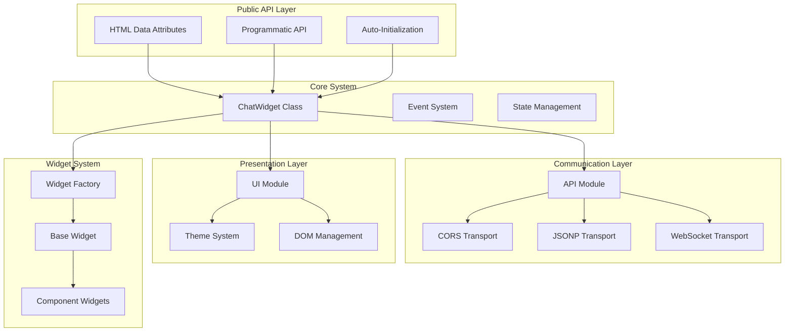
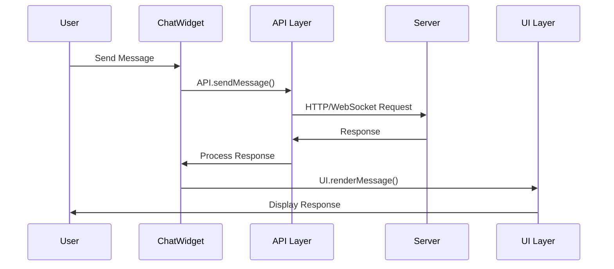

# Architecture

ChatUI follows a modular, event-driven architecture with clear separation of concerns. The design prioritizes performance, maintainability, and extensibility.

## High-Level Architecture



## Core Design Principles

### 1. Zero Dependencies
- Pure vanilla JavaScript implementation
- No external libraries or frameworks
- Compatible with any web environment

### 2. Transport Agnostic
- Abstract API layer supports multiple protocols
- Automatic fallback between WebSocket, CORS, and JSONP
- Protocol detection based on URL scheme

### 3. Scoped Styling
- All CSS scoped to `#chat-widget` ID
- Prevents conflicts with host application
- Theme system for customization

### 4. Event-Driven Communication
- Custom events for widget lifecycle
- Message passing between components
- Extensible event system

## Module Architecture

### Entry Point (`src/entry.js`)
Handles initialization and global API exposure:

```javascript
// Global factory function
window.createChatWidget = function(scriptElement) {
    return new ChatWidget(scriptElement);
};

// Programmatic API
window.ChatUI = {
    init: function(config) {
        return new ChatWidget(config);
    }
};
```

**Responsibilities:**
- Auto-initialization from script tags
- Global API exposure
- MutationObserver for dynamic script tags

### ChatWidget Class (`src/modules/chat-widget.class.js`)
Main orchestrator class that coordinates all subsystems:

```javascript
class ChatWidget {
    constructor(config) {
        this.config = this.parseConfig(config);
        this.api = new API(this.config);
        this.ui = new UI(this.config);
        this.theme = new Theme(this.config);
        this.init();
    }
}
```

**Responsibilities:**
- Configuration parsing and validation
- Component coordination
- Event management
- Lifecycle management

### API Layer (`src/modules/api.js`)
Transport abstraction layer:

```javascript
class API {
    constructor(config) {
        this.transport = this.detectTransport(config.serverUrl);
        this.sessionKey = null;
    }
    
    async handshake() {
        return this.transport.handshake();
    }
}
```

**Transport Classes:**
- **CORS API** (`api-cors.js`): Modern fetch-based communication
- **Legacy API** (`api-legacy.js`): JSONP fallback for older servers
- **WebSocket API**: Real-time bidirectional communication

### UI Layer (`src/modules/ui.js`)
Handles all DOM manipulation and user interactions:

```javascript
class UI {
    constructor(config) {
        this.container = this.createContainer();
        this.messages = [];
        this.setupEventHandlers();
    }
    
    renderMessage(message) {
        // Message rendering logic
    }
}
```

**Responsibilities:**
- DOM creation and management
- Event handling
- Message rendering
- User interaction management

### Theme System (`src/modules/theme.js`)
Manages styling and visual customization:

```javascript
class Theme {
    constructor(config) {
        this.primaryColor = config.color || '#007bff';
        this.mode = config.themeMode || 'light';
        this.applyTheme();
    }
}
```

**Features:**
- Dynamic CSS generation
- Color scheme management
- Light/dark mode support
- Custom CSS injection

## Widget System Architecture

### Widget Factory (`src/modules/widgets/widget-factory.js`)
Creates and manages widget instances:

```javascript
class WidgetFactory {
    static create(type, config) {
        const WidgetClass = widgetRegistry[type];
        return new WidgetClass(config);
    }
}
```

### Base Widget (`src/modules/widgets/base-widget.js`)
Abstract base class for all widgets:

```javascript
class BaseWidget {
    constructor(config) {
        this.config = config;
        this.element = this.createElement();
    }
    
    render() {
        // Abstract method
    }
    
    validate() {
        // Common validation logic
    }
}
```

### Component Widgets
Specialized widgets for different interaction types:

- **Input Widgets**: Text, textarea, password
- **Selection Widgets**: Select, radio, checkbox
- **Interactive Widgets**: Rating, date picker, color picker
- **Action Widgets**: Buttons, confirmation, file upload

## Data Flow Architecture



## State Management

ChatUI uses a simple state management approach:

### Configuration State
```javascript
this.config = {
    serverUrl: string,
    position: string,
    color: string,
    // ... other options
};
```

### Session State
```javascript
this.session = {
    sessionKey: string,
    isOpen: boolean,
    messages: Array,
    typing: boolean
};
```

### UI State
```javascript
this.uiState = {
    currentWidget: Widget,
    focusElement: HTMLElement,
    scrollPosition: number
};
```

## Security Architecture

### XSS Prevention
- Input sanitization for all user content
- Safe HTML generation
- Scoped CSS prevents style injection

### CORS Security
- Proper header validation
- Origin checking
- Timeout protection

### JSONP Security
- Callback name validation
- Response parsing safety
- Fallback mechanisms

## Performance Optimizations

### Bundle Size Optimization
- Tree-shaking for unused widgets
- Minimal core footprint (~12KB)
- Conditional loading of components

### Runtime Optimizations
- Event delegation
- DOM batching
- Lazy loading of widgets

### Memory Management
- Proper cleanup on widget destruction
- Event listener removal
- Reference management

## Extensibility Points

### Custom Widgets
```javascript
class CustomWidget extends BaseWidget {
    render() {
        // Custom implementation
    }
}

WidgetFactory.register('custom', CustomWidget);
```

### Custom Transports
```javascript
class CustomTransport extends BaseTransport {
    async send(data) {
        // Custom transport logic
    }
}

API.registerTransport('custom', CustomTransport);
```

### Theme Extensions
```css
#chat-widget.custom-theme {
    --primary-color: #custom;
    --background: #custom-bg;
}
```

## See Also

- [API Reference](api_reference.md) - Complete API documentation
- [Data Flow](data_flow.md) - Detailed data flow analysis
- [Configuration](configuration.md) - All configuration options
- [Development](development.md) - Development workflow and guidelines
