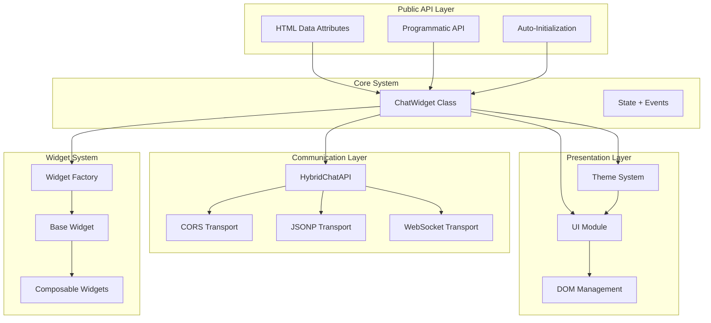
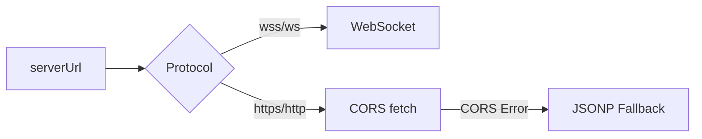
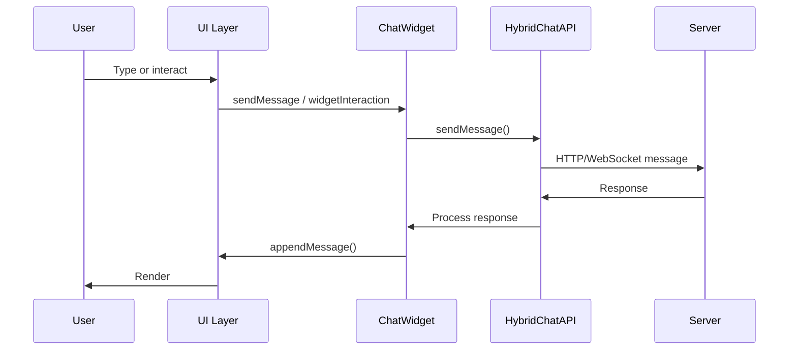

# Architecture

ChatUI uses a modular, event-driven architecture with strict separation of concerns. The design prioritizes performance, maintainability, and extensibility, while remaining framework‑agnostic and dependency‑free.

---

## High-Level Architecture



---

## Module Structure

### Entry Point (`src/entry.js`)
- Exposes `window.ChatUI.init()` for programmatic usage.
- Exposes legacy `window.createChatWidget()`.
- Auto-initializes script tags with `id` starting with `chat-widget`.
- Observes DOM for dynamically inserted script tags.

### Core Orchestrator (`src/modules/chat-widget.class.js`)
- Parses configuration (script element or JS object).
- Initializes theme manager, UI, and transport layer.
- Manages open/close state, message flow, and error handling.
- Handles widget interaction events and forwards to API.

### Communication Layer (`src/modules/api.js`, `api-cors.js`, `api-legacy.js`)
- `HybridChatAPI` selects transport based on `serverUrl` protocol:
  - `wss://` or `ws://` → WebSocket
  - `https://` or `http://` → CORS with JSONP fallback
- CORS transport uses `fetch` with timeouts and error classification.
- JSONP transport remains for legacy environments.

### UI Layer (`src/modules/ui.js`)
- Injects scoped CSS per widget instance.
- Renders messages and widgets.
- Manages message list, input area, and layout.

### Theme System (`src/modules/theme.js`)
- Data-attributes-first theming with CSS variables.
- Supports themes: `default`, `branded`.
- Supports modes: `light`, `dark`.
- Persists preference via `localStorage`.
- Respects `prefers-color-scheme` when no explicit mode is set.

### Widget System (`src/modules/widgets/`)
- `WidgetFactory` creates widgets by type and supports nested children.
- `BaseWidget` provides validation and event dispatch helpers.
- Widgets are composable via `children`.

---

## Transport Selection



---

## Widget System (Composable)

Widgets are defined as a tree. Each widget may include `props` and `children`.

```json
{
  "type": "container",
  "props": { "layout": "vertical", "gap": "medium" },
  "children": [
    { "type": "text", "props": { "content": "Welcome!", "format": "plain" } },
    {
      "type": "buttons",
      "props": {
        "options": [
          { "id": "start", "text": "Get Started", "value": "start" }
        ]
      }
    }
  ]
}
```

### Supported Widget Categories
- **Content/Layout**: `text`, `container`, `card`, `row`, `column`
- **Actions**: `button`, `buttons`, `confirmation`
- **Inputs**: `input`, `password`, `textarea`
- **Selection**: `select`, `radio`, `checkbox`, `toggle`
- **Interactive**: `rating`, `slider`, `date`, `tags`, `color_picker`
- **Data/Advanced**: `file_upload`, `progress`, `list`, `conditional`, `form`

> `image` and `icon` are placeholders mapped to container behavior.

---

## Event Flow



### Key Events
- `widgetInteraction` (document): emitted by widgets when user interacts.
- `widgetValueChanged` (document): emitted on input value changes for forms.
- `chatwidget:error` (window): emitted when errors are surfaced to the user.
- `chatwidget:typing` (window): emitted on WebSocket typing indicators.
- `chatwidget:read_receipt` (window): emitted on WebSocket read receipts.

---

## Security & Reliability

- Input validation and sanitization for messages and widgets.
- JSONP callback names are randomized and validated.
- CORS requests enforce JSON responses and timeouts.
- Scoped CSS prevents style leakage.
- WebSocket URL validation to avoid insecure protocols in production.

---

## Extensibility Points

### Custom Widgets
- Implement a `BaseWidget` subclass.
- Register via `WidgetFactory.registerWidget("custom", CustomWidget)`.

### Theming
- Override CSS variables per widget ID:
  - `--chat-primary`, `--chat-bg`, `--chat-surface`, `--chat-text`, `--chat-border`

---

## See Also

- `docs/livewiki/getting_started.md`
- `docs/livewiki/configuration.md`
- `docs/livewiki/api_reference.md`
- `docs/overview.md`
- `docs/widget-system.md`
