# Data Flow

Understanding how data flows through ChatUI is essential for debugging, customization, and extension. This document traces the complete data lifecycle from user interactions to server responses.

## High-Level Data Flow

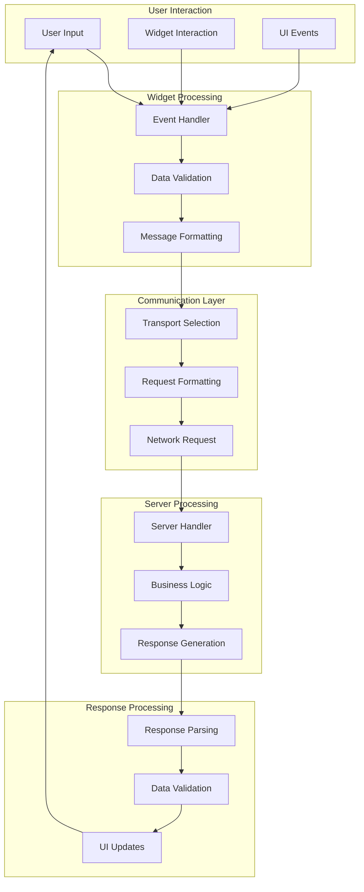

## Message Flow Sequence

### 1. User Input Processing

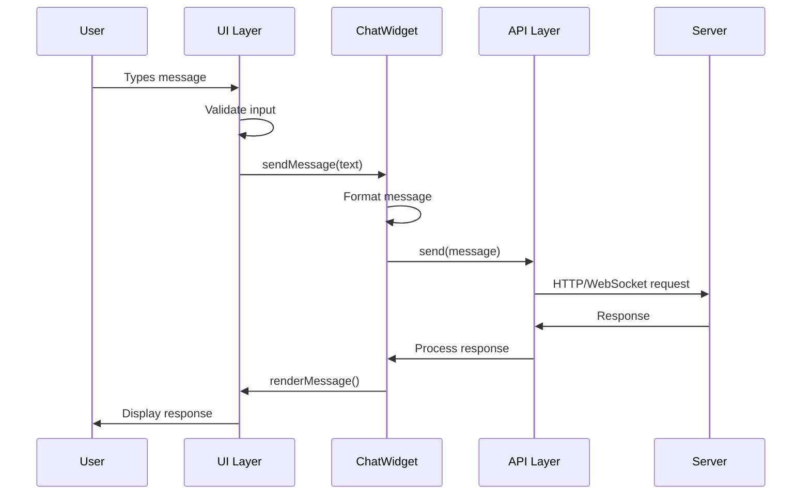

### 2. Widget Interaction Flow

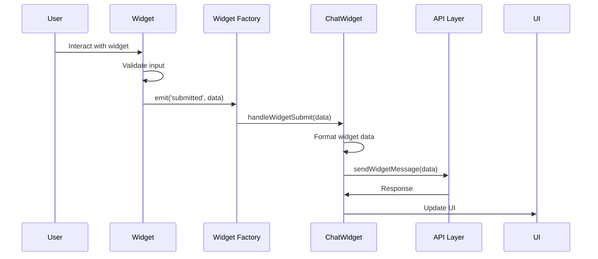

## Transport Layer Data Flow

### CORS Transport Flow

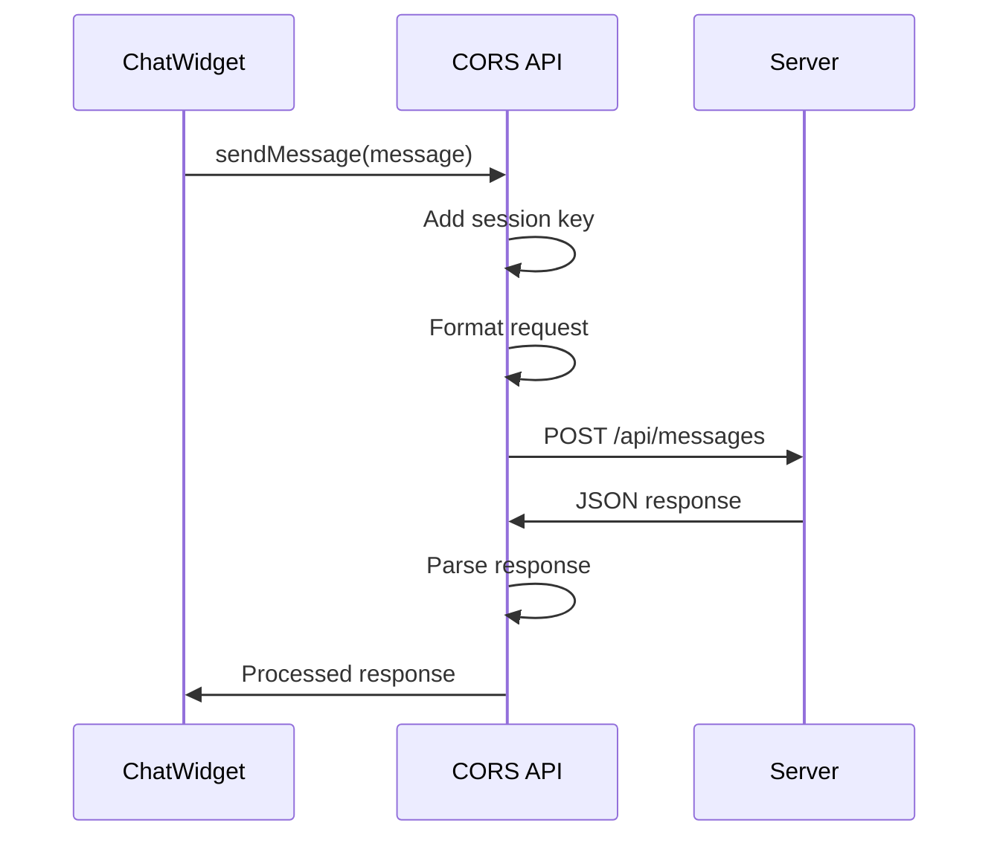

**Request Format:**
```json
{
    "type": "message",
    "message": "Hello world",
    "session_key": "abc123...",
    "timestamp": 1234567890
}
```

**Response Format:**
```json
{
    "text": "Response message",
    "sender": "bot",
    "widget": {
        "type": "rating",
        "config": { "max": 5 }
    }
}
```

### JSONP Transport Flow

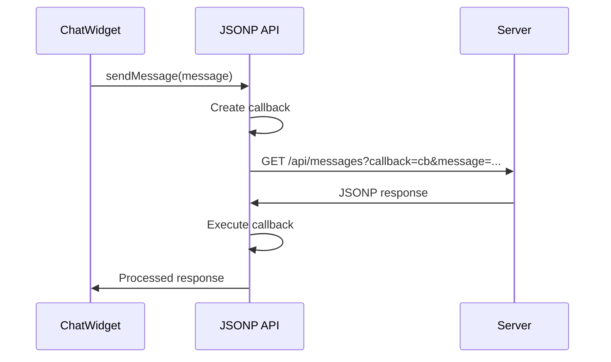

**Request URL:**
```
GET /api/messages?callback=chatui_cb_123&message=Hello&session_key=abc123
```

**Response Format:**
```javascript
chatui_cb_123({
    "text": "Response message",
    "sender": "bot"
});
```

### WebSocket Transport Flow

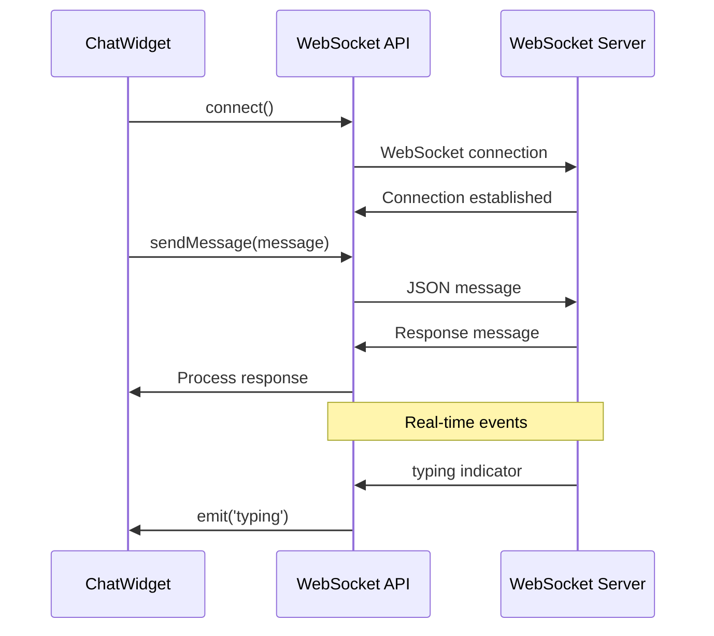

**Message Format:**
```json
{
    "type": "message",
    "payload": {
        "text": "Hello world"
    },
    "session_key": "abc123...",
    "timestamp": 1234567890
}
```

## Event Flow Architecture

### Event Emission Chain

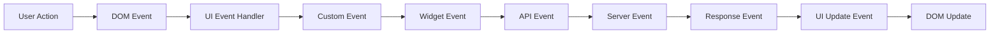

### Event Types and Flow

#### 1. User Interface Events
```javascript
// DOM Events
element.addEventListener('click', handleClick);
element.addEventListener('keydown', handleKeydown);

// Custom UI Events
this.emit('ui:message_send', { text: message });
this.emit('ui:widget_submit', { widgetId, data });
```

#### 2. Widget Events
```javascript
// Widget Creation
this.emit('widget:created', { widgetId, type, config });

// Widget Interaction
this.emit('widget:focus', { widgetId });
this.emit('widget:blur', { widgetId });
this.emit('widget:submit', { widgetId, data });
```

#### 3. Communication Events
```javascript
// API Events
this.emit('api:request', { type, data });
this.emit('api:response', { data });
this.emit('api:error', { error });

// Connection Events
this.emit('connection:established');
this.emit('connection:lost');
this.emit('connection:error', { error });
```

#### 4. Global Events
```javascript
// Window Events
window.dispatchEvent(new CustomEvent('chatwidget:message', {
    detail: { message, sender, type }
}));

window.dispatchEvent(new CustomEvent('chatwidget:connected'));
```

## State Management Flow

### Configuration State Flow

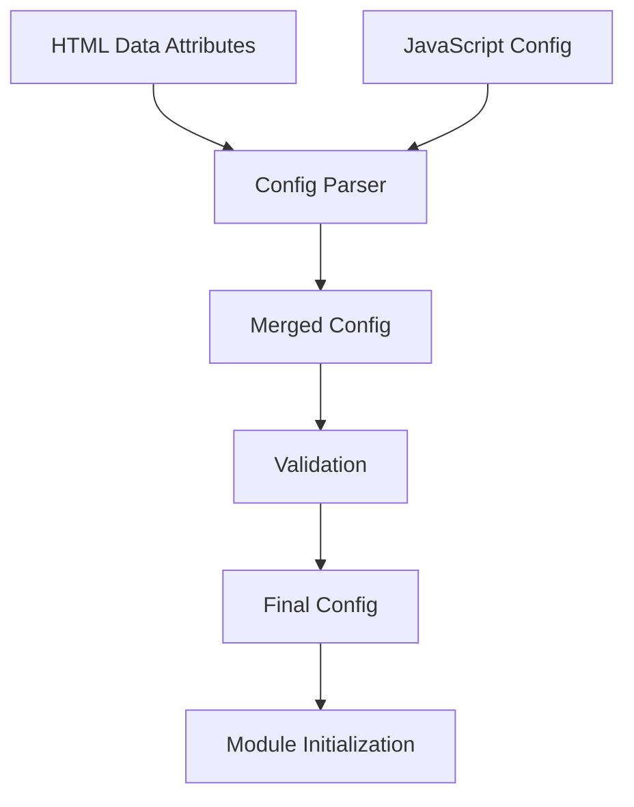

### Session State Flow

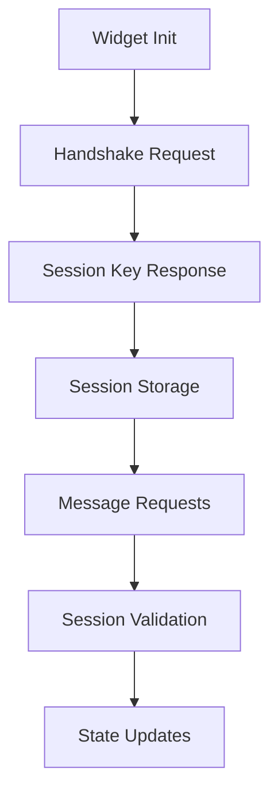

### UI State Flow

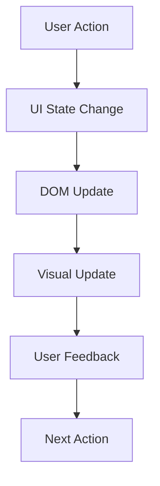

## Data Validation Flow

### Input Validation Chain

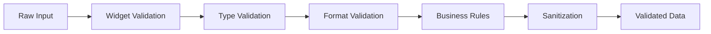

### Response Validation Chain

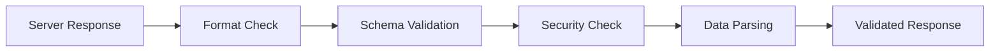

## Error Handling Flow

### Error Propagation

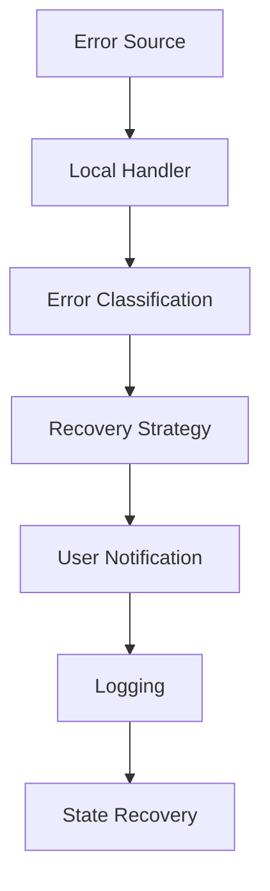

### Error Types and Handling

#### 1. Network Errors
```javascript
try {
    await this.api.sendMessage(message);
} catch (error) {
    if (error.type === 'network') {
        this.handleNetworkError(error);
    } else if (error.type === 'timeout') {
        this.handleTimeoutError(error);
    }
}
```

#### 2. Validation Errors
```javascript
function validateMessage(message) {
    if (!message || message.trim().length === 0) {
        throw new ValidationError('Message cannot be empty');
    }
    if (message.length > 1000) {
        throw new ValidationError('Message too long');
    }
    return true;
}
```

#### 3. Widget Errors
```javascript
try {
    const widget = this.addWidget(type, config);
} catch (error) {
    this.emit('widget:error', { type, error });
    this.showErrorMessage('Failed to create widget');
}
```

## Performance Optimization Flow

### Message Batching

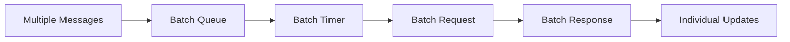

### DOM Update Batching

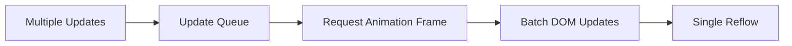

## Debugging Data Flow

### Debug Event Tracking

```javascript
// Enable debug mode
window.ChatUI.debug = true;

// Track all events
window.addEventListener('chatwidget:*', (event) => {
    console.log(`Event: ${event.type}`, event.detail);
});
```

### Network Request Debugging

```javascript
// Intercept API calls
const originalSend = API.prototype.send;
API.prototype.send = function(data) {
    console.log('API Request:', data);
    return originalSend.call(this, data).then(response => {
        console.log('API Response:', response);
        return response;
    });
};
```

## See Also

- [Architecture](architecture.md) - System design overview
- [API Reference](api_reference.md) - Complete API documentation
- [Configuration](configuration.md) - All configuration options
- [Troubleshooting](troubleshooting.md) - Common issues and solutions
