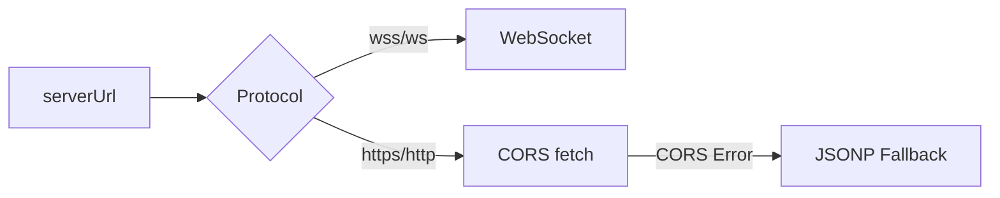
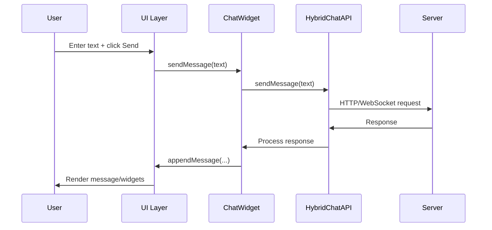
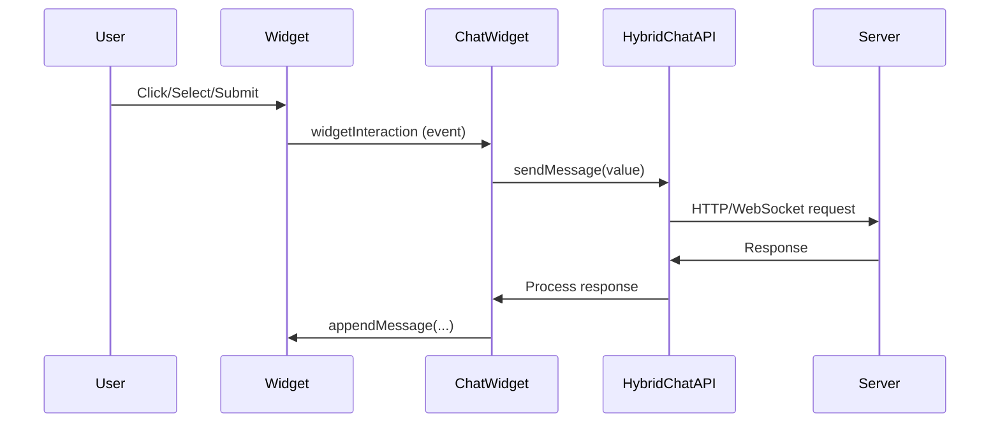
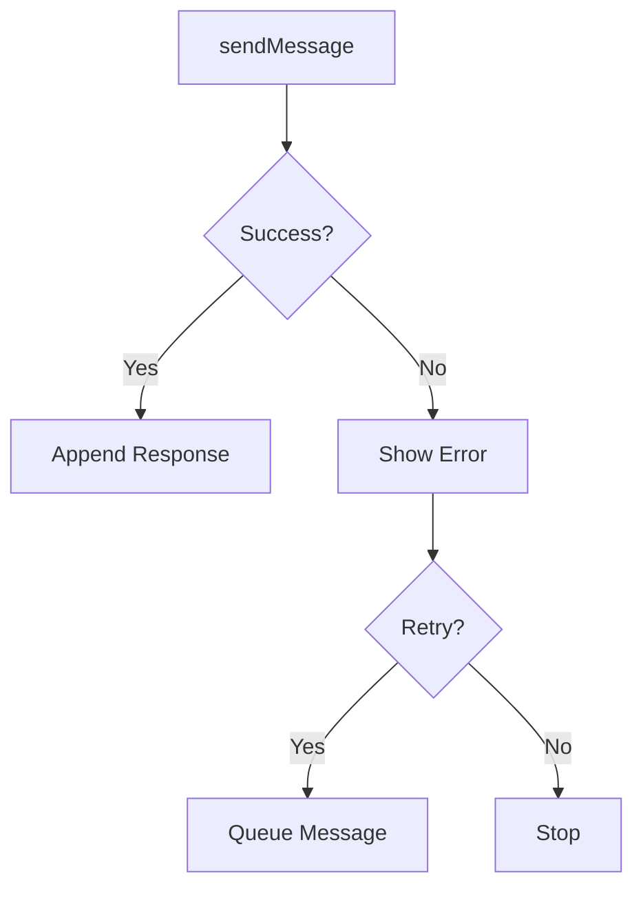

# Data Flow

This document traces how data moves through ChatUI from user input and widget interactions to backend responses. It reflects the **current runtime behavior** (hybrid transport, composable widgets, and event dispatch).

---

## High-Level Flow

```mermaid
graph TB
    subgraph "User Interaction"
        A[User Input]
        B[Widget Interaction]
    end
    
    subgraph "ChatUI Core"
        C[ChatWidget]
        D[UI Layer]
        E[Widget System]
    end
    
    subgraph "Transport Layer"
        F[HybridChatAPI]
        G[CORS (fetch)]
        H[JSONP Fallback]
        I[WebSocket]
    end
    
    subgraph "Backend"
        J[Server Endpoints]
    end
    
    A --> D --> C
    B --> E --> C
    C --> F
    F --> G --> J
    F --> H --> J
    F --> I --> J
    J --> F --> C --> D
```

---

## Transport Selection

ChatUI chooses transport based on the `serverUrl` protocol:

- `wss://` or `ws://` → **WebSocket**
- `https://` or `http://` → **CORS (fetch)** with **JSONP fallback** on CORS/network errors



---

## Message Flow (User Text)

### 1) User Sends a Message


### CORS Request Format
```json
{
  "type": "message",
  "message": "Hello",
  "session_key": "session-id",
  "timestamp": 1234567890
}
```

### CORS Response (Preferred)
```json
{
  "status": "success",
  "widgets": [
    { "type": "text", "props": { "content": "Hi there!", "format": "plain" } }
  ]
}
```

### CORS Response (Legacy Supported)
```json
{
  "status": "success",
  "text": "Hi there!",
  "sender": "bot"
}
```

---

## Widget Interaction Flow

Widgets emit `widgetInteraction` events that are captured by `ChatWidget` and sent to the backend.



### Example Widget Interaction Payload
```json
{
  "widgetId": "chat-widget-xyz",
  "optionId": "support",
  "optionValue": "support",
  "optionText": "Support",
  "widgetType": "buttons"
}
```

---

## Composable Widget Rendering

Preferred server responses include a `widgets` array (composable tree).

```json
{
  "status": "success",
  "widgets": [
    {
      "type": "card",
      "children": [
        { "type": "text", "props": { "content": "Welcome!", "format": "plain" } },
        {
          "type": "buttons",
          "props": {
            "options": [
              { "id": "start", "text": "Get Started", "value": "start" }
            ]
          }
        }
      ]
    }
  ]
}
```

The UI layer uses `WidgetFactory` to recursively create elements for each widget and its `children`.

---

## WebSocket Data Flow

### Client → Server
```json
{
  "type": "message",
  "payload": "Hello",
  "session_key": "session-id",
  "timestamp": 1234567890
}
```

### Server → Client (Composable)
```json
{
  "type": "message",
  "widgets": [
    { "type": "text", "props": { "content": "Hello!", "format": "plain" } }
  ],
  "timestamp": 1234567890
}
```

### Real-Time Events
- **Typing** → `chatwidget:typing`
- **Read Receipt** → `chatwidget:read_receipt`

---

## Event Flow Summary

### Emitted Events (Document)
- `widgetInteraction` → user interacts with widget
- `widgetValueChanged` → input value changes (used by forms)

### Emitted Events (Window)
- `chatwidget:error` → error surfaced to user
- `chatwidget:typing` → typing indicator received
- `chatwidget:read_receipt` → read receipt received

---

## Error & Retry Flow

ChatWidget handles failures with:
- user-friendly error banners
- optional retries with backoff
- queued message retries (up to configured limits)



---

## See Also

- `docs/livewiki/architecture.md`
- `docs/livewiki/api_reference.md`
- `docs/backend-integration-guide.md`
- `docs/widget-system.md`
