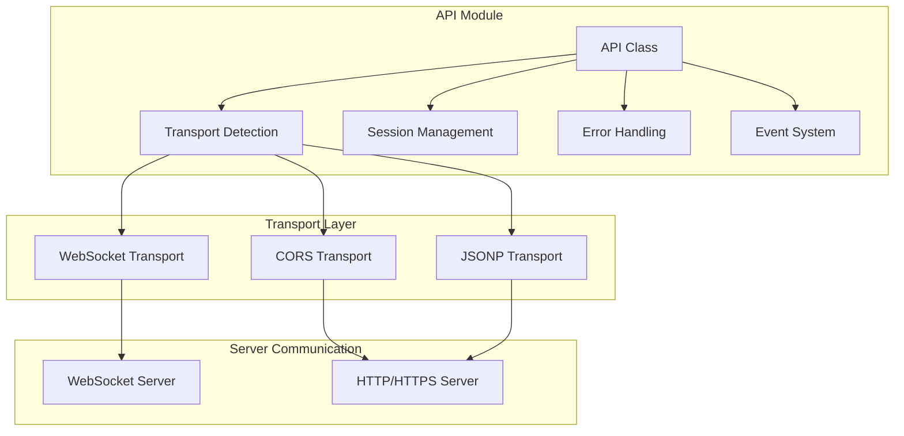

# API Module

The API module provides a transport-agnostic abstraction layer for communicating with chat servers. It automatically detects and handles different transport protocols (WebSocket, CORS, JSONP) with intelligent fallback mechanisms.

## Overview

The API module serves as the communication hub that:
- Abstracts different transport protocols
- Handles automatic protocol detection
- Manages session establishment and maintenance
- Provides unified interface for all communication types
- Implements error handling and retry logic
- Manages connection state and reconnection

## Architecture



## Core API Class

```javascript
class API {
    constructor(config)
    
    // Connection Management
    connect()
    disconnect()
    isConnected()
    
    // Communication
    handshake()
    sendMessage(message, data)
    sendTyping(typing)
    sendReadReceipt(messageId)
    
    // Session Management
    getSessionKey()
    setSessionKey(key)
    resetSession()
    
    // Events
    on(event, handler)
    off(event, handler)
    emit(event, data)
}
```

## Constructor

```javascript
constructor(config)
```

**Parameters:**
- `config` (object): Configuration object containing server URL and options

**Behavior:**
1. Detects appropriate transport based on server URL
2. Initializes transport instance
3. Sets up event handlers
4. Prepares for connection

**Example:**
```javascript
const api = new API({
    serverUrl: 'https://api.example.com',
    timeout: 5000,
    autoReconnect: true,
    headers: {
        'Authorization': 'Bearer token123'
    }
});
```

## Transport Detection

The API module automatically detects the appropriate transport based on the server URL:

### WebSocket Detection
```javascript
if (url.startsWith('ws://') || url.startsWith('wss://')) {
    return new WebSocketTransport(config);
}
```

### CORS/JSONP Detection
```javascript
if (url.startsWith('http://') || url.startsWith('https://')) {
    if (config.preferJsonP || config.forceJsonP) {
        return new JSONPTransport(config);
    } else {
        return new CORSTransport(config);
    }
}
```

## Connection Management

### `connect()`
Establishes connection to the server.

```javascript
await api.connect();
```

**Returns:**
- `Promise`: Resolves when connection is established

**Events Emitted:**
- `connecting`
- `connected`
- `connection:error`

### `disconnect()`
Closes the connection to the server.

```javascript
api.disconnect();
```

**Events Emitted:**
- `disconnecting`
- `disconnected`

### `isConnected()`
Returns the current connection state.

```javascript
const connected = api.isConnected();
console.log(connected); // true/false
```

**Returns:**
- `boolean`: Current connection state

## Communication Methods

### `handshake()`
Establishes session with the server.

```javascript
const response = await api.handshake();
console.log('Session key:', response.session_key);
```

**Returns:**
- `Promise<Object>`: Handshake response containing session key

**Response Format:**
```javascript
{
    status: 'success',
    session_key: 'abc123...',
    timestamp: 1234567890
}
```

### `sendMessage(message, data)`
Sends a message to the server.

```javascript
await api.sendMessage('Hello, world!');
await api.sendMessage('Select option', { 
    type: 'select', 
    options: ['A', 'B', 'C'] 
});
```

**Parameters:**
- `message` (string): Message text
- `data` (object, optional): Additional message data

**Returns:**
- `Promise<Object>`: Server response

**Response Format:**
```javascript
{
    text: 'Response message',
    sender: 'bot',
    widget: {
        type: 'rating',
        config: { max: 5 }
    },
    timestamp: 1234567890
}
```

### `sendTyping(typing)`
Sends typing indicator.

```javascript
api.sendTyping(true);  // Start typing
api.sendTyping(false); // Stop typing
```

**Parameters:**
- `typing` (boolean): Typing state

### `sendReadReceipt(messageId)`
Sends read receipt for a message.

```javascript
api.sendReadReceipt('msg-123');
```

**Parameters:**
- `messageId` (string): Message identifier

## Session Management

### `getSessionKey()`
Returns the current session key.

```javascript
const sessionKey = api.getSessionKey();
```

**Returns:**
- `string`: Session key or `null` if not established

### `setSessionKey(key)`
Sets the session key.

```javascript
api.setSessionKey('abc123...');
```

**Parameters:**
- `key` (string): Session key

### `resetSession()`
Resets the current session.

```javascript
api.resetSession();
```

**Behavior:**
1. Clears current session key
2. Performs new handshake
3. Updates connection state

## Event System

The API module emits various events for connection state and communication:

### Connection Events

```javascript
api.on('connecting', () => {
    console.log('Connecting to server...');
});

api.on('connected', () => {
    console.log('Connected to server');
});

api.on('disconnected', () => {
    console.log('Disconnected from server');
});

api.on('connection:error', (error) => {
    console.error('Connection error:', error);
});
```

### Message Events

```javascript
api.on('message', (message) => {
    console.log('Received message:', message);
});

api.on('message:sent', (message) => {
    console.log('Message sent:', message);
});

api.on('typing', (data) => {
    console.log('Typing indicator:', data.typing);
});

api.on('read_receipt', (data) => {
    console.log('Read receipt:', data.messageId);
});
```

### Session Events

```javascript
api.on('session:established', (sessionKey) => {
    console.log('Session established:', sessionKey);
});

api.on('session:expired', () => {
    console.log('Session expired');
});

api.on('session:reset', () => {
    console.log('Session reset');
});
```

## Error Handling

The API module implements comprehensive error handling:

### Error Types

```javascript
class APIError extends Error {
    constructor(type, message, originalError) {
        super(message);
        this.type = type;
        this.originalError = originalError;
    }
}

// Error types
const ERROR_TYPES = {
    NETWORK: 'network',
    TIMEOUT: 'timeout',
    VALIDATION: 'validation',
    SESSION: 'session',
    TRANSPORT: 'transport'
};
```

### Error Recovery

```javascript
class API {
    async sendMessage(message, data) {
        try {
            return await this.transport.sendMessage(message, data);
        } catch (error) {
            if (error.type === 'network' && this.config.autoReconnect) {
                await this.reconnect();
                return await this.transport.sendMessage(message, data);
            } else if (error.type === 'session') {
                await this.resetSession();
                return await this.transport.sendMessage(message, data);
            } else {
                throw error;
            }
        }
    }
}
```

## Transport Abstraction

### Base Transport Interface

```javascript
class BaseTransport {
    constructor(config) {
        this.config = config;
        this.connected = false;
    }
    
    async connect() {
        throw new Error('connect() must be implemented');
    }
    
    async disconnect() {
        throw new Error('disconnect() must be implemented');
    }
    
    async handshake() {
        throw new Error('handshake() must be implemented');
    }
    
    async sendMessage(message, data) {
        throw new Error('sendMessage() must be implemented');
    }
    
    isConnected() {
        return this.connected;
    }
}
```

### Transport Registration

```javascript
class API {
    static registerTransport(name, TransportClass) {
        this.transports[name] = TransportClass;
    }
    
    static getTransport(name) {
        return this.transports[name];
    }
}

// Register custom transport
API.registerTransport('custom', CustomTransport);
```

## Configuration Options

```javascript
const config = {
    // Connection
    serverUrl: 'https://api.example.com',
    timeout: 5000,
    autoReconnect: true,
    reconnectDelay: 1000,
    maxReconnectAttempts: 5,
    
    // Authentication
    headers: {
        'Authorization': 'Bearer token123',
        'X-API-Key': 'api-key-123'
    },
    
    // Transport preferences
    preferJsonP: false,
    forceJsonP: false,
    
    // Session management
    sessionTimeout: 3600000, // 1 hour
    autoResetSession: true,
    
    // Debugging
    debug: false,
    logLevel: 'info'
};
```

## Usage Examples

### Basic Usage

```javascript
const api = new API({
    serverUrl: 'https://api.example.com'
});

// Connect and handshake
await api.connect();
await api.handshake();

// Send message
const response = await api.sendMessage('Hello!');
console.log(response.text);
```

### WebSocket Usage

```javascript
const api = new API({
    serverUrl: 'wss://api.example.com/ws',
    autoReconnect: true,
    reconnectDelay: 2000
});

api.on('connected', () => {
    console.log('WebSocket connected');
});

api.on('message', (message) => {
    console.log('Real-time message:', message);
});

await api.connect();
```

### Error Handling

```javascript
const api = new API({
    serverUrl: 'https://api.example.com',
    timeout: 5000
});

api.on('connection:error', async (error) => {
    if (error.type === 'network') {
        console.log('Network error, retrying...');
        await api.reconnect();
    }
});

try {
    await api.sendMessage('Hello!');
} catch (error) {
    console.error('Failed to send message:', error);
}
```

### Custom Transport

```javascript
class CustomTransport extends BaseTransport {
    async connect() {
        // Custom connection logic
        this.connected = true;
        this.emit('connected');
    }
    
    async sendMessage(message, data) {
        // Custom message sending logic
        return { text: 'Custom response', sender: 'bot' };
    }
}

API.registerTransport('custom', CustomTransport);

const api = new API({
    serverUrl: 'custom://example.com'
});
```

## Performance Considerations

### Connection Pooling

```javascript
class API {
    constructor(config) {
        this.connectionPool = new Map();
    }
    
    async getConnection(url) {
        if (!this.connectionPool.has(url)) {
            const transport = this.createTransport(url);
            await transport.connect();
            this.connectionPool.set(url, transport);
        }
        return this.connectionPool.get(url);
    }
}
```

### Request Batching

```javascript
class API {
    constructor(config) {
        this.messageQueue = [];
        this.batchTimeout = null;
    }
    
    async sendMessage(message, data) {
        this.messageQueue.push({ message, data });
        
        if (!this.batchTimeout) {
            this.batchTimeout = setTimeout(() => {
                this.flushMessageQueue();
            }, 100);
        }
    }
    
    async flushMessageQueue() {
        const messages = this.messageQueue.splice(0);
        await this.transport.sendBatch(messages);
        this.batchTimeout = null;
    }
}
```

## See Also

- [CORS API](api-cors.md) - CORS transport implementation
- [Legacy API](api-legacy.md) - JSONP transport implementation
- [ChatWidget Class](chat-widget-class.md) - Main widget class
- [Data Flow](../data_flow.md) - Data flow documentation
