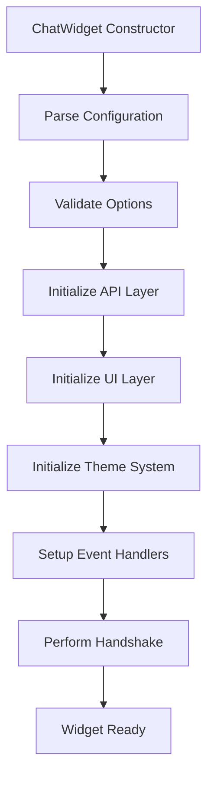
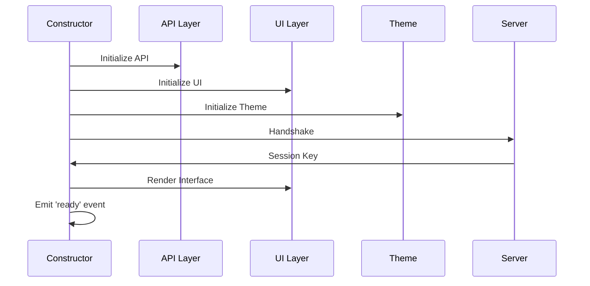
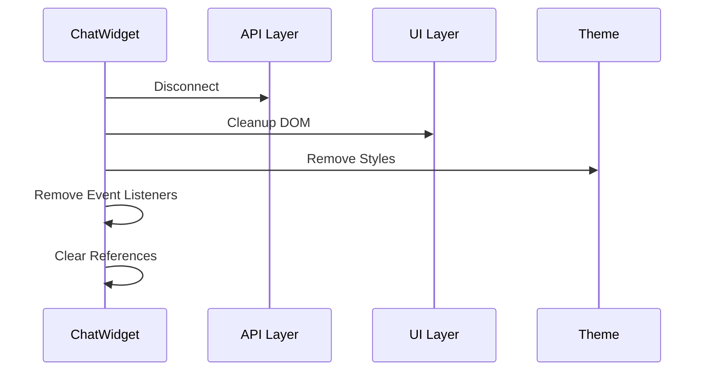

# ChatWidget Class

The main `ChatWidget` class is the core orchestrator that coordinates all subsystems of the ChatUI widget. It handles initialization, configuration, event management, and lifecycle management.

## Overview

The `ChatWidget` class serves as the central hub that:
- Parses and validates configuration
- Initializes and coordinates subsystems
- Manages widget lifecycle (open/close/destroy)
- Handles event routing and delegation
- Provides the public API interface

## Class Structure

```javascript
class ChatWidget {
    constructor(config)
    
    // Public API Methods
    open()
    close()
    toggle()
    isOpen()
    sendMessage(text, data)
    addMessage(text, sender, type)
    clearMessages()
    getMessages()
    
    // Widget Management
    addWidget(type, config)
    removeWidget(widgetId)
    clearWidgets()
    
    // Configuration
    updateConfig(newConfig)
    getConfig()
    
    // Session Management
    getSessionKey()
    resetSession()
    
    // Lifecycle
    init()
    destroy()
}
```

## Constructor

```javascript
constructor(config)
```

**Parameters:**
- `config` (object|string): Configuration object or script element

**Behavior:**
1. Parses configuration from object or script element
2. Validates required options
3. Initializes subsystems (API, UI, Theme)
4. Sets up event handlers
5. Performs initial handshake with server

**Example:**
```javascript
// From configuration object
const chat = new ChatWidget({
    serverUrl: 'https://api.example.com',
    title: 'Support Chat',
    color: '#28a745'
});

// From script element
const script = document.getElementById('chat-widget');
const chat = new ChatWidget(script);
```

## Public API Methods

### Widget Control

#### `open()`
Opens the chat widget interface.

```javascript
chat.open();
```

**Events Emitted:**
- `chatwidget:open`

#### `close()`
Closes the chat widget interface.

```javascript
chat.close();
```

**Events Emitted:**
- `chatwidget:close`

#### `toggle()`
Toggles the widget between open and closed states.

```javascript
chat.toggle();
```

#### `isOpen()`
Returns the current open state.

```javascript
const isOpen = chat.isOpen();
console.log(isOpen); // true/false
```

**Returns:**
- `boolean`: Current open state

### Message Management

#### `sendMessage(text, data)`
Sends a message to the server.

```javascript
chat.sendMessage('Hello, I need help!');
chat.sendMessage('Select option', { type: 'select', options: ['A', 'B', 'C'] });
```

**Parameters:**
- `text` (string): Message text
- `data` (object, optional): Additional message data

**Returns:**
- `Promise`: Resolves when message is sent

**Events Emitted:**
- `chatwidget:message:sent`

#### `addMessage(text, sender, type)`
Adds a message locally without sending to server.

```javascript
chat.addMessage('Welcome!', 'bot', 'text');
chat.addMessage('User message', 'user', 'text');
```

**Parameters:**
- `text` (string): Message text
- `sender` (string): Message sender (`'user'` or `'bot'`)
- `type` (string): Message type (`'text'`, `'widget'`, etc.)

#### `clearMessages()`
Clears all messages from the chat.

```javascript
chat.clearMessages();
```

#### `getMessages()`
Returns all messages in the chat.

```javascript
const messages = chat.getMessages();
console.log(messages); // Array of message objects
```

**Returns:**
- `Array`: Array of message objects

### Widget Management

#### `addWidget(type, config)`
Adds an interactive widget to the chat.

```javascript
chat.addWidget('rating', { max: 5, required: true });
chat.addWidget('date', { min: '2024-01-01', max: '2024-12-31' });
```

**Parameters:**
- `type` (string): Widget type
- `config` (object): Widget configuration

**Returns:**
- `Widget`: Widget instance

**Events Emitted:**
- `chatwidget:widget:created`

#### `removeWidget(widgetId)`
Removes a widget from the chat.

```javascript
chat.removeWidget('rating-123');
```

**Parameters:**
- `widgetId` (string): Widget identifier

#### `clearWidgets()`
Removes all widgets from the chat.

```javascript
chat.clearWidgets();
```

### Configuration

#### `updateConfig(newConfig)`
Updates widget configuration.

```javascript
chat.updateConfig({
    title: 'Updated Title',
    color: '#ff6b6b'
});
```

**Parameters:**
- `newConfig` (object): New configuration options

#### `getConfig()`
Returns current widget configuration.

```javascript
const config = chat.getConfig();
console.log(config.serverUrl);
```

**Returns:**
- `object`: Current configuration

### Session Management

#### `getSessionKey()`
Returns the current session key.

```javascript
const sessionKey = chat.getSessionKey();
```

**Returns:**
- `string`: Session key or `null` if not established

#### `resetSession()`
Resets the current session and establishes a new one.

```javascript
chat.resetSession();
```

## Internal Architecture

### Subsystem Initialization



### Event System

The ChatWidget class manages a comprehensive event system:

```javascript
// Internal events
this.emit('internal:message_send', { text, data });
this.emit('internal:widget_create', { type, config });
this.emit('internal:config_update', { newConfig });

// External events
window.dispatchEvent(new CustomEvent('chatwidget:message', {
    detail: { message, sender, type }
}));
```

### State Management

```javascript
// Configuration state
this.config = {
    serverUrl: string,
    position: string,
    color: string,
    // ... other options
};

// Session state
this.session = {
    sessionKey: string,
    isOpen: boolean,
    messages: Array,
    typing: boolean
};

// UI state
this.uiState = {
    currentWidget: Widget,
    focusElement: HTMLElement,
    scrollPosition: number
};
```

## Lifecycle Management

### Initialization Flow



### Destruction Flow



## Error Handling

The ChatWidget class implements comprehensive error handling:

```javascript
class ChatWidget {
    async sendMessage(text, data) {
        try {
            // Validate input
            if (!text || text.trim().length === 0) {
                throw new Error('Message cannot be empty');
            }
            
            // Send via API
            const response = await this.api.sendMessage(text, data);
            
            // Handle response
            this.handleResponse(response);
            
        } catch (error) {
            // Classify error
            if (error.type === 'network') {
                this.handleNetworkError(error);
            } else if (error.type === 'validation') {
                this.handleValidationError(error);
            } else {
                this.handleGenericError(error);
            }
            
            // Emit error event
            this.emit('error', { error, context: 'sendMessage' });
        }
    }
}
```

## Extension Points

### Custom Event Handlers

```javascript
class ChatWidget {
    constructor(config) {
        // ... initialization
        
        // Setup custom handlers
        if (config.onOpen) this.on('open', config.onOpen);
        if (config.onClose) this.on('close', config.onClose);
        if (config.onMessage) this.on('message', config.onMessage);
        if (config.onError) this.on('error', config.onError);
    }
}
```

### Plugin System

```javascript
class ChatWidget {
    use(plugin, options) {
        if (typeof plugin === 'function') {
            plugin(this, options);
        } else if (plugin && plugin.install) {
            plugin.install(this, options);
        }
        return this;
    }
}

// Example plugin
const loggingPlugin = {
    install(chatWidget, options) {
        const originalSendMessage = chatWidget.sendMessage;
        chatWidget.sendMessage = function(text, data) {
            console.log('Sending message:', text);
            return originalSendMessage.call(this, text, data);
        };
    }
};

chat.use(loggingPlugin);
```

## Performance Considerations

### Memory Management

```javascript
class ChatWidget {
    destroy() {
        // Clear references
        this.api = null;
        this.ui = null;
        this.theme = null;
        
        // Remove event listeners
        this.removeAllListeners();
        
        // Clear DOM references
        this.container = null;
        this.element = null;
        
        // Clear session data
        this.session = null;
        this.messages = [];
    }
}
```

### Event Optimization

```javascript
class ChatWidget {
    constructor(config) {
        // Use event delegation for better performance
        this.container.addEventListener('click', this.handleContainerClick.bind(this));
        this.container.addEventListener('keydown', this.handleContainerKeydown.bind(this));
    }
    
    handleContainerClick(event) {
        const widget = event.target.closest('[data-widget]');
        if (widget) {
            this.handleWidgetClick(widget, event);
        }
    }
}
```

## Usage Examples

### Basic Usage

```javascript
// Simple initialization
const chat = new ChatWidget({
    serverUrl: 'https://api.example.com',
    title: 'Support Chat'
});

// Send a message
chat.sendMessage('Hello, I need help!');

// Open the widget
chat.open();
```

### Advanced Usage

```javascript
const chat = new ChatWidget({
    serverUrl: 'wss://api.example.com/ws',
    title: 'Live Support',
    color: '#28a745',
    position: 'bottom-left',
    onMessage: (message) => console.log('New message:', message),
    onError: (error) => console.error('Error:', error)
});

// Add custom widget
chat.addWidget('rating', {
    max: 5,
    required: true,
    onSubmit: (rating) => console.log('Rating:', rating)
});

// Listen for events
window.addEventListener('chatwidget:open', () => {
    console.log('Widget opened');
});
```

### Plugin Usage

```javascript
// Custom analytics plugin
const analyticsPlugin = {
    install(chatWidget, options) {
        chatWidget.on('message:sent', (message) => {
            // Track message sent
            if (options.tracking) {
                options.tracking.track('message_sent', {
                    length: message.text.length
                });
            }
        });
    }
};

const chat = new ChatWidget(config);
chat.use(analyticsPlugin, { tracking: window.analytics });
```

## See Also

- [API Module](api.md) - API layer documentation
- [UI Module](ui.md) - UI layer documentation
- [Theme System](theme.md) - Theme system documentation
- [Widget Factory](widget-factory.md) - Widget factory documentation
