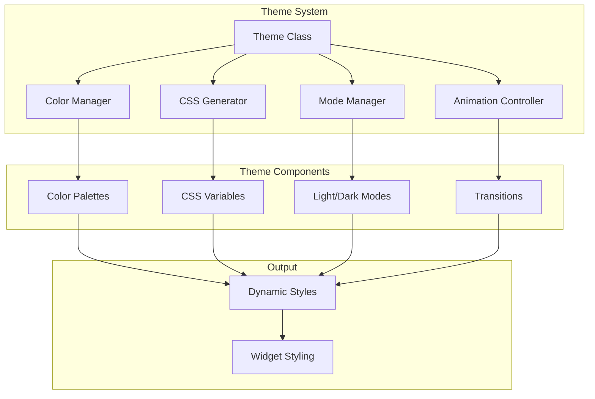

# Theme System

The theme system manages all visual aspects of the ChatUI widget, including colors, typography, spacing, animations, and responsive behavior. It provides a flexible theming framework with built-in light/dark modes and extensive customization options.

## Overview

The theme system is responsible for:
- Dynamic CSS generation and injection
- Color scheme management
- Light/dark mode support
- Custom CSS variable management
- Responsive design handling
- Animation and transition control
- Accessibility considerations

## Architecture



## Core Theme Class

```javascript
class Theme {
    constructor(config)
    
    // Theme Management
    applyTheme(themeName)
    setTheme(themeName)
    getTheme()
    
    // Color Management
    setPrimaryColor(color)
    setColorVariable(name, value)
    getColorVariable(name)
    
    // Mode Management
    setMode(mode) // 'light' | 'dark' | 'auto'
    getMode()
    toggleMode()
    
    // CSS Management
    generateCSS()
    injectCSS(css)
    updateCSS()
    
    // Custom Styling
    addCustomCSS(css)
    removeCustomCSS(id)
    
    // Responsive Design
    applyResponsiveStyles()
    handleResize()
}
```

## Constructor

```javascript
constructor(config)
```

**Parameters:**
- `config` (object): Configuration object containing theme options

**Behavior:**
1. Initializes theme configuration
2. Sets up color variables
3. Generates initial CSS
4. Applies theme mode
5. Sets up responsive handling

**Example:**
```javascript
const theme = new Theme({
    primaryColor: '#007bff',
    mode: 'light',
    customCSS: '.header { background: #333; }',
    responsive: true
});
```

## Color System

### Color Variables

The theme system uses CSS custom properties for dynamic theming:

```css
:root {
    /* Primary Colors */
    --chatui-primary-color: #007bff;
    --chatui-primary-hover: #0056b3;
    --chatui-primary-light: #b3d7ff;
    
    /* Background Colors */
    --chatui-background-color: #ffffff;
    --chatui-surface-color: #f8f9fa;
    --chatui-overlay-color: #000000;
    
    /* Text Colors */
    --chatui-text-color: #333333;
    --chatui-text-muted: #6c757d;
    --chatui-text-inverse: #ffffff;
    
    /* Border Colors */
    --chatui-border-color: #dee2e6;
    --chatui-border-light: #e9ecef;
    --chatui-border-dark: #adb5bd;
    
    /* Status Colors */
    --chatui-success-color: #28a745;
    --chatui-warning-color: #ffc107;
    --chatui-error-color: #dc3545;
    --chatui-info-color: #17a2b8;
}
```

### Dark Mode Colors

```css
[data-theme="dark"] {
    --chatui-primary-color: #0d6efd;
    --chatui-primary-hover: #0b5ed7;
    --chatui-primary-light: #3c8aff;
    
    --chatui-background-color: #1a1a1a;
    --chatui-surface-color: #2d2d2d;
    --chatui-overlay-color: #ffffff;
    
    --chatui-text-color: #ffffff;
    --chatui-text-muted: #adb5bd;
    --chatui-text-inverse: #000000;
    
    --chatui-border-color: #495057;
    --chatui-border-light: #343a40;
    --chatui-border-dark: #6c757d;
}
```

### Color Methods

#### `setPrimaryColor(color)`
Sets the primary color for the theme.

```javascript
theme.setPrimaryColor('#28a745');
```

**Parameters:**
- `color` (string): Hex color code

**Behavior:**
1. Validates color format
2. Generates color variations
3. Updates CSS variables
4. Regenerates theme CSS

#### `setColorVariable(name, value)`
Sets a custom CSS variable.

```javascript
theme.setColorVariable('--chatui-accent-color', '#ff6b6b');
theme.setColorVariable('--chatui-custom-bg', '#f8f9fa');
```

#### `getColorVariable(name)`
Gets the current value of a CSS variable.

```javascript
const primaryColor = theme.getColorVariable('--chatui-primary-color');
console.log(primaryColor); // '#007bff'
```

## Theme Modes

### Light Mode

```javascript
theme.setMode('light');
```

**Characteristics:**
- Light backgrounds
- Dark text
- High contrast
- Optimized for daylight viewing

### Dark Mode

```javascript
theme.setMode('dark');
```

**Characteristics:**
- Dark backgrounds
- Light text
- Reduced eye strain
- Optimized for low-light viewing

### Auto Mode

```javascript
theme.setMode('auto');
```

**Behavior:**
- Automatically detects system preference
- Switches based on `prefers-color-scheme`
- Updates when system theme changes

### Mode Detection

```javascript
class Theme {
    detectSystemTheme() {
        if (window.matchMedia && window.matchMedia('(prefers-color-scheme: dark)').matches) {
            return 'dark';
        }
        return 'light';
    }
    
    setupSystemThemeListener() {
        if (window.matchMedia) {
            const mediaQuery = window.matchMedia('(prefers-color-scheme: dark)');
            mediaQuery.addListener((e) => {
                if (this.config.mode === 'auto') {
                    this.setMode(e.matches ? 'dark' : 'light');
                }
            });
        }
    }
}
```

## CSS Generation

### Dynamic CSS Generation

```javascript
class Theme {
    generateCSS() {
        let css = ':root {\n';
        
        // Add color variables
        Object.entries(this.colorVariables).forEach(([name, value]) => {
            css += `  ${name}: ${value};\n`;
        });
        
        css += '}\n\n';
        
        // Add component styles
        css += this.generateComponentStyles();
        
        // Add responsive styles
        if (this.config.responsive) {
            css += this.generateResponsiveStyles();
        }
        
        // Add custom CSS
        if (this.config.customCSS) {
            css += '\n/* Custom CSS */\n' + this.config.customCSS;
        }
        
        return css;
    }
}
```

### Component Styles

```javascript
class Theme {
    generateComponentStyles() {
        return `
/* Header Styles */
#chat-widget .header {
    background-color: var(--chatui-primary-color);
    color: var(--chatui-text-inverse);
    border-radius: var(--chatui-border-radius) var(--chatui-border-radius) 0 0;
}

/* Message Styles */
#chat-widget .message.user {
    background-color: var(--chatui-primary-color);
    color: var(--chatui-text-inverse);
}

#chat-widget .message.bot {
    background-color: var(--chatui-surface-color);
    color: var(--chatui-text-color);
    border: 1px solid var(--chatui-border-color);
}

/* Input Styles */
#chat-widget .message-input {
    background-color: var(--chatui-background-color);
    color: var(--chatui-text-color);
    border: 1px solid var(--chatui-border-color);
}

#chat-widget .message-input:focus {
    border-color: var(--chatui-primary-color);
    box-shadow: 0 0 0 2px var(--chatui-primary-light);
}

/* Button Styles */
#chat-widget .send-button {
    background-color: var(--chatui-primary-color);
    color: var(--chatui-text-inverse);
}

#chat-widget .send-button:hover {
    background-color: var(--chatui-primary-hover);
}
        `;
    }
}
```

## Custom Styling

### Adding Custom CSS

```javascript
theme.addCustomCSS(`
    .chat-widget .header {
        background: linear-gradient(45deg, var(--chatui-primary-color), var(--chatui-primary-hover));
    }
    
    .message.user {
        border-radius: 18px 18px 4px 18px;
    }
    
    .message.bot {
        border-radius: 18px 18px 18px 4px;
    }
`);
```

### Theme Variants

```javascript
class Theme {
    createVariant(name, overrides) {
        this.variants[name] = {
            ...this.defaultConfig,
            ...overrides
        };
    }
    
    applyVariant(name) {
        const variant = this.variants[name];
        if (variant) {
            this.config = { ...this.config, ...variant };
            this.updateCSS();
        }
    }
}

// Create custom variants
theme.createVariant('minimalist', {
    borderRadius: '4px',
    shadow: 'none',
    animations: false
});

theme.createVariant('rounded', {
    borderRadius: '16px',
    shadow: '0 8px 32px rgba(0,0,0,0.1)'
});
```

## Animation System

### Transition Control

```javascript
class Theme {
    generateAnimationStyles() {
        return `
/* Transitions */
#chat-widget * {
    transition: background-color 0.3s ease, 
                color 0.3s ease, 
                border-color 0.3s ease,
                box-shadow 0.3s ease;
}

/* Widget Open/Close */
.chat-widget {
    transition: transform 0.3s cubic-bezier(0.4, 0, 0.2, 1),
                opacity 0.3s cubic-bezier(0.4, 0, 0.2, 1);
}

/* Message Animations */
.message {
    animation: messageSlideIn 0.3s cubic-bezier(0.4, 0, 0.2, 1);
}

@keyframes messageSlideIn {
    from {
        opacity: 0;
        transform: translateY(20px);
    }
    to {
        opacity: 1;
        transform: translateY(0);
    }
}

/* Typing Indicator */
.typing-indicator {
    animation: typingPulse 1.5s infinite;
}

@keyframes typingPulse {
    0%, 60%, 100% { opacity: 1; }
    30% { opacity: 0.5; }
}
        `;
    }
}
```

### Animation Control

```javascript
class Theme {
    setAnimations(enabled) {
        this.config.animations = enabled;
        if (enabled) {
            this.container.classList.remove('no-animations');
        } else {
            this.container.classList.add('no-animations');
        }
    }
    
    setAnimationDuration(duration) {
        this.setColorVariable('--chatui-animation-duration', duration);
    }
}
```

## Responsive Design

### Breakpoint System

```javascript
class Theme {
    getBreakpoints() {
        return {
            mobile: '768px',
            tablet: '1024px',
            desktop: '1200px'
        };
    }
    
    generateResponsiveStyles() {
        const breakpoints = this.getBreakpoints();
        
        return `
/* Mobile Styles */
@media (max-width: ${breakpoints.mobile}) {
    #chat-widget {
        width: 100vw !important;
        height: 100vh !important;
        position: fixed !important;
        bottom: 0 !important;
        right: 0 !important;
        left: 0 !important;
        top: 0 !important;
        border-radius: 0 !important;
    }
    
    #chat-widget .messages-container {
        height: calc(100vh - 120px);
    }
}

/* Tablet Styles */
@media (min-width: ${breakpoints.mobile}) and (max-width: ${breakpoints.tablet}) {
    #chat-widget {
        width: 90vw;
        max-width: 500px;
        height: 80vh;
    }
}

/* Desktop Styles */
@media (min-width: ${breakpoints.tablet}) {
    #chat-widget {
        width: 380px;
        height: 600px;
    }
}
        `;
    }
}
```

## Accessibility

### High Contrast Mode

```javascript
class Theme {
    enableHighContrast() {
        this.setColorVariable('--chatui-text-color', '#000000');
        this.setColorVariable('--chatui-background-color', '#ffffff');
        this.setColorVariable('--chatui-border-color', '#000000');
        this.setColorVariable('--chatui-primary-color', '#0000ff');
    }
    
    detectHighContrast() {
        if (window.matchMedia && window.matchMedia('(prefers-contrast: high)').matches) {
            this.enableHighContrast();
        }
    }
}
```

### Reduced Motion

```javascript
class Theme {
    handleReducedMotion() {
        if (window.matchMedia && window.matchMedia('(prefers-reduced-motion: reduce)').matches) {
            this.setAnimations(false);
            this.setColorVariable('--chatui-animation-duration', '0s');
        }
    }
}
```

## Usage Examples

### Basic Theme Setup

```javascript
const theme = new Theme({
    primaryColor: '#007bff',
    mode: 'light',
    responsive: true
});

// Apply theme
theme.applyTheme();
```

### Custom Color Scheme

```javascript
const theme = new Theme({
    primaryColor: '#6366f1',
    mode: 'dark',
    customColors: {
        '--chatui-accent-color': '#f59e0b',
        '--chatui-success-color': '#10b981',
        '--chatui-error-color': '#ef4444'
    }
});
```

### Dynamic Theme Switching

```javascript
// Toggle between light and dark modes
function toggleTheme() {
    const currentMode = theme.getMode();
    const newMode = currentMode === 'light' ? 'dark' : 'light';
    theme.setMode(newMode);
}

// Listen for system theme changes
window.matchMedia('(prefers-color-scheme: dark)').addListener((e) => {
    if (theme.getMode() === 'auto') {
        theme.setMode(e.matches ? 'dark' : 'light');
    }
});
```

### Custom Styling

```javascript
const theme = new Theme({
    primaryColor: '#007bff',
    customCSS: `
        .chat-widget {
            font-family: 'Inter', sans-serif;
            border-radius: 16px;
            box-shadow: 0 10px 40px rgba(0,0,0,0.1);
        }
        
        .message.user {
            background: linear-gradient(135deg, #667eea 0%, #764ba2 100%);
        }
        
        .header {
            backdrop-filter: blur(10px);
            background: rgba(0, 123, 255, 0.9);
        }
    `
});
```

## Performance Considerations

### CSS Optimization

```javascript
class Theme {
    optimizeCSS(css) {
        // Minify CSS
        return css
            .replace(/\/\*[\s\S]*?\*\//g, '') // Remove comments
            .replace(/\s+/g, ' ')             // Collapse whitespace
            .replace(/;\s*}/g, '}')           // Remove unnecessary semicolons
            .trim();
    }
    
    debounceUpdate() {
        clearTimeout(this.updateTimeout);
        this.updateTimeout = setTimeout(() => {
            this.updateCSS();
        }, 100);
    }
}
```

### Memory Management

```javascript
class Theme {
    destroy() {
        // Remove CSS
        if (this.styleElement) {
            document.head.removeChild(this.styleElement);
        }
        
        // Clear event listeners
        if (this.resizeObserver) {
            this.resizeObserver.disconnect();
        }
        
        // Clear references
        this.config = null;
        this.colorVariables = null;
    }
}
```

## See Also

- [UI Module](ui.md) - UI management documentation
- [ChatWidget Class](chat-widget-class.md) - Main widget class
- [Configuration](../configuration.md) - Configuration options
- [Development](../development.md) - Development guidelines
