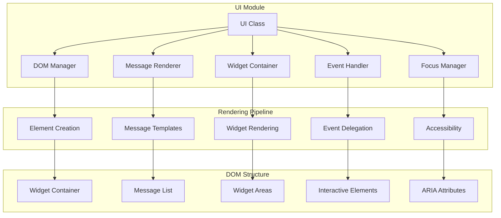

# UI Module

The UI module handles all DOM manipulation, message rendering, widget management, and user interactions for the ChatUI widget. It provides a clean abstraction layer for all UI-related operations.

## Overview

The UI module is responsible for:
- DOM creation and management
- Message rendering and display
- Widget container management
- Event handling and delegation
- Focus management and accessibility
- Animation and transitions
- Responsive behavior

## Architecture



## Core UI Class

```javascript
class UI {
    constructor(config)
    
    // DOM Management
    createContainer()
    destroyContainer()
    getContainer()
    
    // Message Management
    renderMessage(message)
    clearMessages()
    scrollToBottom()
    
    // Widget Management
    addWidget(widget)
    removeWidget(widgetId)
    clearWidgets()
    
    // Display Control
    show()
    hide()
    toggle()
    isVisible()
    
    // Event Handling
    setupEventHandlers()
    removeEventHandlers()
    
    // Focus Management
    setFocus(element)
    restoreFocus()
    trapFocus()
}
```

## Constructor

```javascript
constructor(config)
```

**Parameters:**
- `config` (object): Configuration object containing UI options

**Behavior:**
1. Creates main widget container
2. Sets up DOM structure
3. Initializes event handlers
4. Applies theme and styling
5. Sets up focus management

**Example:**
```javascript
const ui = new UI({
    position: 'bottom-right',
    width: '380px',
    height: '600px',
    showHeader: true,
    showFooter: true,
    zIndex: 9999
});
```

## DOM Structure

The UI module creates a structured DOM hierarchy:

```html
<div id="chat-widget" class="chat-widget bottom-right">
    <div class="chat-widget-container">
        <!-- Header -->
        <div class="header">
            <div class="title">Chat with us</div>
            <button class="close-button" aria-label="Close chat">×</button>
        </div>
        
        <!-- Messages Container -->
        <div class="messages-container">
            <div class="messages-list">
                <!-- Messages rendered here -->
            </div>
        </div>
        
        <!-- Widget Container -->
        <div class="widget-container">
            <!-- Interactive widgets rendered here -->
        </div>
        
        <!-- Input Area -->
        <div class="input-area">
            <textarea class="message-input" placeholder="Type a message..."></textarea>
            <button class="send-button" aria-label="Send message">Send</button>
        </div>
        
        <!-- Footer -->
        <div class="footer">
            <!-- Footer content -->
        </div>
    </div>
    
    <!-- Toggle Button (when closed) -->
    <button class="toggle-button" aria-label="Open chat">
        <span class="toggle-icon">💬</span>
    </button>
</div>
```

## Message Management

### `renderMessage(message)`
Renders a message in the chat interface.

```javascript
ui.renderMessage({
    text: 'Hello, world!',
    sender: 'bot',
    type: 'text',
    timestamp: 1234567890
});
```

**Parameters:**
- `message` (object): Message object with text, sender, type, etc.

**Message Object Format:**
```javascript
{
    id: 'msg-123',
    text: 'Message text',
    sender: 'user' | 'bot',
    type: 'text' | 'widget' | 'system',
    timestamp: 1234567890,
    data: {}, // Additional data for widgets
    metadata: {} // Additional metadata
}
```

### Message Templates

The UI module uses templates for different message types:

#### Text Message Template
```html
<div class="message user" data-message-id="msg-123">
    <div class="message-content">
        <div class="message-text">Hello, world!</div>
        <div class="message-timestamp">10:30 AM</div>
    </div>
</div>
```

#### Widget Message Template
```html
<div class="message bot" data-message-id="msg-124">
    <div class="message-content">
        <div class="message-text">Please rate your experience:</div>
        <div class="message-widget" data-widget-type="rating">
            <!-- Widget rendered here -->
        </div>
    </div>
</div>
```

### `clearMessages()`
Clears all messages from the chat interface.

```javascript
ui.clearMessages();
```

### `scrollToBottom()`
Scrolls the messages container to the bottom.

```javascript
ui.scrollToBottom();
```

## Widget Management

### `addWidget(widget)`
Adds a widget to the widget container.

```javascript
const widget = new RatingWidget({ max: 5 });
ui.addWidget(widget);
```

**Parameters:**
- `widget` (Widget): Widget instance to add

### `removeWidget(widgetId)`
Removes a widget from the container.

```javascript
ui.removeWidget('rating-123');
```

**Parameters:**
- `widgetId` (string): Widget identifier

### `clearWidgets()`
Removes all widgets from the container.

```javascript
ui.clearWidgets();
```

## Display Control

### `show()`
Shows the chat widget interface.

```javascript
ui.show();
```

**Events Emitted:**
- `ui:shown`

### `hide()`
Hides the chat widget interface.

```javascript
ui.hide();
```

**Events Emitted:**
- `ui:hidden`

### `toggle()`
Toggles the widget visibility.

```javascript
ui.toggle();
```

### `isVisible()`
Returns the current visibility state.

```javascript
const visible = ui.isVisible();
console.log(visible); // true/false
```

**Returns:**
- `boolean`: Current visibility state

## Event Handling

The UI module implements comprehensive event handling with delegation:

### Event Delegation

```javascript
class UI {
    setupEventHandlers() {
        // Use event delegation for better performance
        this.container.addEventListener('click', this.handleClick.bind(this));
        this.container.addEventListener('keydown', this.handleKeydown.bind(this));
        this.container.addEventListener('focus', this.handleFocus.bind(this), true);
        this.container.addEventListener('blur', this.handleBlur.bind(this), true);
    }
    
    handleClick(event) {
        const target = event.target;
        
        // Handle close button
        if (target.closest('.close-button')) {
            this.emit('close_requested');
            return;
        }
        
        // Handle send button
        if (target.closest('.send-button')) {
            this.emit('send_requested');
            return;
        }
        
        // Handle widget interactions
        const widgetElement = target.closest('[data-widget-id]');
        if (widgetElement) {
            this.handleWidgetInteraction(widgetElement, event);
            return;
        }
    }
}
```

### Input Handling

```javascript
class UI {
    handleKeydown(event) {
        const target = event.target;
        
        // Handle message input
        if (target.classList.contains('message-input')) {
            if (event.key === 'Enter' && !event.shiftKey) {
                event.preventDefault();
                this.emit('send_requested');
            } else {
                this.emit('typing', { typing: true });
            }
        }
        
        // Handle escape key
        if (event.key === 'Escape') {
            this.emit('escape_pressed');
        }
    }
}
```

### Focus Management

```javascript
class UI {
    setFocus(element) {
        this.previousFocus = document.activeElement;
        element.focus();
        this.emit('focus_changed', { element, previous: this.previousFocus });
    }
    
    restoreFocus() {
        if (this.previousFocus && this.previousFocus.focus) {
            this.previousFocus.focus();
            this.previousFocus = null;
        }
    }
    
    trapFocus() {
        this.container.addEventListener('keydown', (event) => {
            if (event.key === 'Tab') {
                const focusableElements = this.getFocusableElements();
                const firstElement = focusableElements[0];
                const lastElement = focusableElements[focusableElements.length - 1];
                
                if (event.shiftKey) {
                    if (document.activeElement === firstElement) {
                        event.preventDefault();
                        lastElement.focus();
                    }
                } else {
                    if (document.activeElement === lastElement) {
                        event.preventDefault();
                        firstElement.focus();
                    }
                }
            }
        });
    }
}
```

## Accessibility

The UI module implements comprehensive accessibility features:

### ARIA Attributes

```javascript
class UI {
    createMessage(message) {
        const messageElement = this.createElement('div', 'message');
        messageElement.setAttribute('data-message-id', message.id);
        messageElement.setAttribute('role', 'article');
        messageElement.setAttribute('aria-label', `${message.sender} message: ${message.text}`);
        
        if (message.sender === 'bot') {
            messageElement.setAttribute('aria-live', 'polite');
        }
        
        return messageElement;
    }
}
```

### Keyboard Navigation

```javascript
class UI {
    setupKeyboardNavigation() {
        // Tab navigation
        this.container.setAttribute('tabindex', '0');
        
        // Arrow key navigation for messages
        this.container.addEventListener('keydown', (event) => {
            if (event.key === 'ArrowUp' || event.key === 'ArrowDown') {
                this.navigateMessages(event.key === 'ArrowUp' ? -1 : 1);
                event.preventDefault();
            }
        });
    }
}
```

### Screen Reader Support

```javascript
class UI {
    announceToScreenReader(message) {
        const announcement = this.createElement('div', 'sr-only');
        announcement.setAttribute('role', 'status');
        announcement.setAttribute('aria-live', 'polite');
        announcement.textContent = message;
        
        document.body.appendChild(announcement);
        
        setTimeout(() => {
            document.body.removeChild(announcement);
        }, 1000);
    }
}
```

## Animation and Transitions

### CSS Animations

```css
/* Slide in animation */
.chat-widget {
    transform: translateY(100%);
    opacity: 0;
    transition: transform 0.3s ease-out, opacity 0.3s ease-out;
}

.chat-widget.open {
    transform: translateY(0);
    opacity: 1;
}

/* Message appearance animation */
.message {
    animation: messageSlideIn 0.3s ease-out;
}

@keyframes messageSlideIn {
    from {
        transform: translateY(20px);
        opacity: 0;
    }
    to {
        transform: translateY(0);
        opacity: 1;
    }
}
```

### JavaScript Animations

```javascript
class UI {
    animateMessageEntry(element) {
        element.style.opacity = '0';
        element.style.transform = 'translateY(20px)';
        
        requestAnimationFrame(() => {
            element.style.transition = 'opacity 0.3s ease-out, transform 0.3s ease-out';
            element.style.opacity = '1';
            element.style.transform = 'translateY(0)';
        });
    }
    
    animateWidgetEntry(element) {
        element.style.maxHeight = '0';
        element.style.overflow = 'hidden';
        
        requestAnimationFrame(() => {
            element.style.transition = 'max-height 0.3s ease-out';
            element.style.maxHeight = element.scrollHeight + 'px';
        });
    }
}
```

## Responsive Design

### Media Queries

```css
/* Mobile styles */
@media (max-width: 768px) {
    .chat-widget {
        width: 100vw !important;
        height: 100vh !important;
        position: fixed !important;
        bottom: 0 !important;
        right: 0 !important;
        left: 0 !important;
        top: 0 !important;
        border-radius: 0 !important;
    }
}

/* Tablet styles */
@media (min-width: 769px) and (max-width: 1024px) {
    .chat-widget {
        width: 90vw;
        max-width: 500px;
    }
}
```

### JavaScript Responsiveness

```javascript
class UI {
    handleResize() {
        const width = window.innerWidth;
        
        if (width <= 768) {
            this.container.classList.add('mobile');
            this.applyMobileLayout();
        } else {
            this.container.classList.remove('mobile');
            this.applyDesktopLayout();
        }
    }
    
    applyMobileLayout() {
        this.config.width = '100vw';
        this.config.height = '100vh';
        this.updateContainerStyles();
    }
}
```

## Performance Optimization

### DOM Batching

```javascript
class UI {
    constructor(config) {
        this.updateQueue = [];
        this.updateScheduled = false;
    }
    
    scheduleUpdate(updateFn) {
        this.updateQueue.push(updateFn);
        
        if (!this.updateScheduled) {
            this.updateScheduled = true;
            requestAnimationFrame(() => this.flushUpdates());
        }
    }
    
    flushUpdates() {
        const updates = this.updateQueue.splice(0);
        
        updates.forEach(update => update());
        
        this.updateScheduled = false;
    }
}
```

### Virtual Scrolling

```javascript
class UI {
    renderMessages(messages) {
        const visibleMessages = this.getVisibleMessages(messages);
        const fragment = document.createDocumentFragment();
        
        visibleMessages.forEach(message => {
            const messageElement = this.createMessageElement(message);
            fragment.appendChild(messageElement);
        });
        
        this.messagesList.innerHTML = '';
        this.messagesList.appendChild(fragment);
    }
    
    getVisibleMessages(messages) {
        const scrollTop = this.messagesContainer.scrollTop;
        const containerHeight = this.messagesContainer.clientHeight;
        const messageHeight = this.estimateMessageHeight();
        
        const startIndex = Math.floor(scrollTop / messageHeight);
        const endIndex = Math.ceil((scrollTop + containerHeight) / messageHeight);
        
        return messages.slice(startIndex, endIndex + 1);
    }
}
```

## Usage Examples

### Basic Usage

```javascript
const ui = new UI({
    position: 'bottom-right',
    width: '380px',
    height: '600px'
});

// Render a message
ui.renderMessage({
    text: 'Hello, world!',
    sender: 'bot',
    type: 'text'
});

// Show the widget
ui.show();
```

### Custom Event Handling

```javascript
const ui = new UI(config);

ui.on('send_requested', () => {
    const input = ui.getInput();
    const message = input.value.trim();
    
    if (message) {
        ui.emit('message_send', { text: message });
        input.value = '';
    }
});

ui.on('close_requested', () => {
    ui.hide();
});
```

### Custom Styling

```javascript
const ui = new UI({
    ...config,
    customCSS: `
        .chat-widget .header {
            background: linear-gradient(45deg, #007bff, #0056b3);
        }
        
        .message.user {
            background-color: #007bff;
            color: white;
        }
    `
});
```

## See Also

- [ChatWidget Class](chat-widget-class.md) - Main widget class
- [Theme System](theme.md) - Theme system documentation
- [Widget Factory](widget-factory.md) - Widget factory documentation
- [API Reference](../api_reference.md) - Complete API documentation
