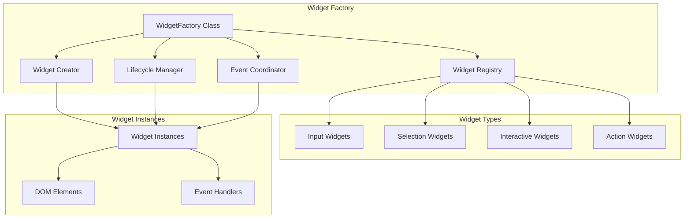
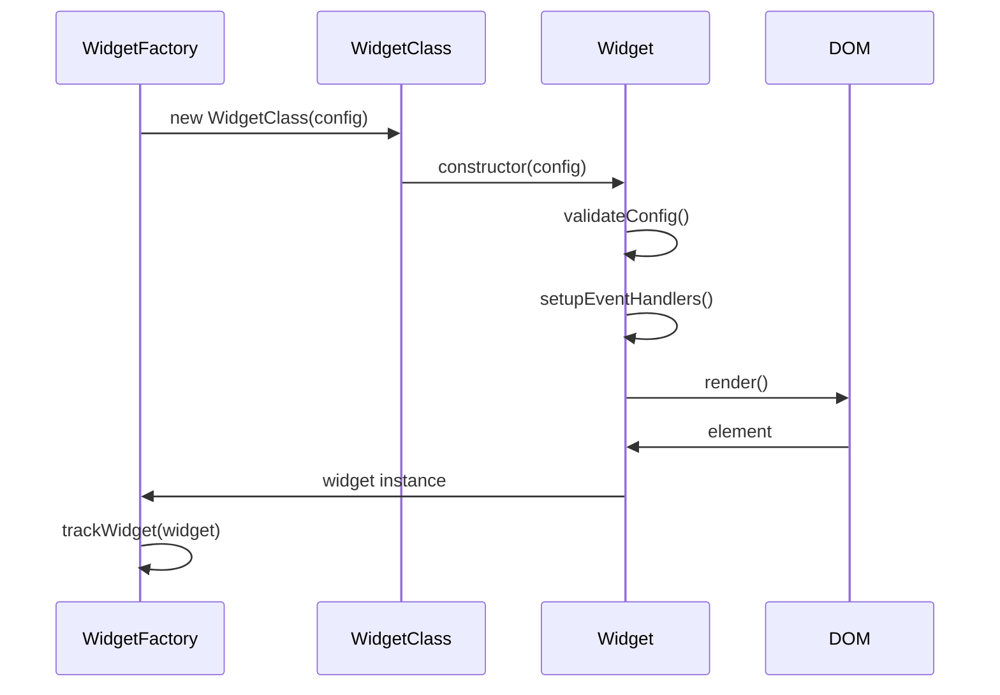
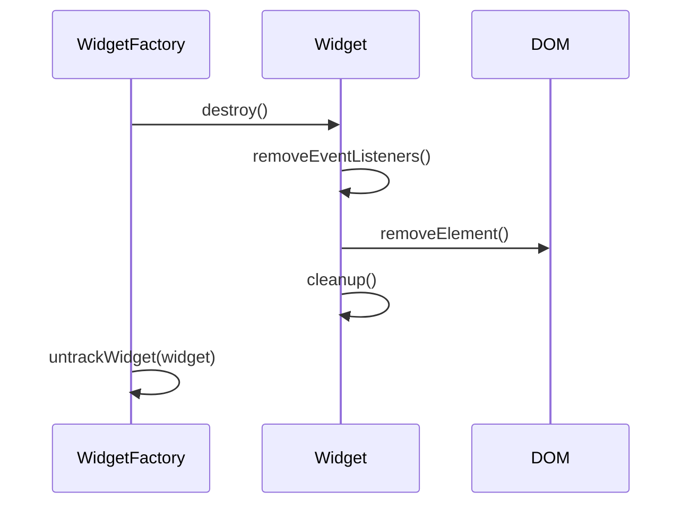

# Widget Factory

The Widget Factory is responsible for creating, managing, and coordinating all interactive widget components within the ChatUI system. It provides a centralized factory pattern for widget instantiation and lifecycle management.

## Overview

The Widget Factory handles:
- Widget registration and discovery
- Dynamic widget creation
- Widget lifecycle management
- Event coordination between widgets
- Widget validation and error handling
- Memory management and cleanup

## Architecture



## Core WidgetFactory Class

```javascript
class WidgetFactory {
    constructor()
    
    // Widget Registration
    register(type, WidgetClass)
    unregister(type)
    isRegistered(type)
    getRegisteredTypes()
    
    // Widget Creation
    create(type, config)
    createBatch(widgets)
    createFromMessage(message)
    
    // Widget Management
    getWidget(id)
    getAllWidgets()
    removeWidget(id)
    clearWidgets()
    
    // Event Management
    emit(event, data)
    on(event, handler)
    off(event, handler)
    
    // Validation
    validateWidgetType(type)
    validateWidgetConfig(type, config)
}
```

## Widget Registration

### `register(type, WidgetClass)`
Registers a new widget type with the factory.

```javascript
import { CustomWidget } from './custom-widget.js';

WidgetFactory.register('custom', CustomWidget);
```

**Parameters:**
- `type` (string): Widget type identifier
- `WidgetClass` (class): Widget class extending BaseWidget

**Requirements:**
- WidgetClass must extend BaseWidget
- Must implement required methods: `render()`, `validate()`, `getValue()`
- Should have a static `type` property matching the registration type

### Built-in Widget Types

The factory comes with pre-registered widget types:

```javascript
// Input Widgets
'input'      -> InputWidget
'textarea'   -> TextareaWidget
'password'   -> PasswordWidget

// Selection Widgets
'select'     -> SelectWidget
'radio'      -> RadioWidget
'checkbox'   -> CheckboxWidget
'toggle'     -> ToggleWidget

// Interactive Widgets
'rating'     -> RatingWidget
'date'       -> DateWidget
'color-picker' -> ColorPickerWidget
'slider'     -> SliderWidget
'tags'       -> TagsWidget

// Action Widgets
'button'     -> ButtonWidget
'confirmation' -> ConfirmationWidget
'file-upload' -> FileUploadWidget

// Display Widgets
'text'       -> TextWidget
'card'       -> CardWidget
'progress'   -> ProgressWidget
'container'  -> ContainerWidget
```

## Widget Creation

### `create(type, config)`
Creates a new widget instance.

```javascript
const ratingWidget = WidgetFactory.create('rating', {
    max: 5,
    required: true,
    onSubmit: (value) => console.log('Rating:', value)
});
```

**Parameters:**
- `type` (string): Widget type identifier
- `config` (object): Widget configuration

**Returns:**
- `Widget`: Widget instance

**Throws:**
- `Error`: If widget type is not registered
- `ValidationError`: If configuration is invalid

### `createBatch(widgets)`
Creates multiple widgets at once.

```javascript
const widgets = WidgetFactory.createBatch([
    { type: 'input', config: { placeholder: 'Name', required: true } },
    { type: 'email', config: { placeholder: 'Email' } },
    { type: 'rating', config: { max: 5 } }
]);
```

**Parameters:**
- `widgets` (array): Array of widget specifications

**Returns:**
- `Array<Widget>`: Array of widget instances

### `createFromMessage(message)`
Creates widgets from a message object.

```javascript
const widgets = WidgetFactory.createFromMessage({
    text: 'Please rate your experience:',
    widget: {
        type: 'rating',
        config: { max: 5, required: true }
    }
});
```

**Parameters:**
- `message` (object): Message object containing widget specification

**Returns:**
- `Widget|null`: Widget instance or null if no widget specified

## Widget Configuration

### Standard Configuration Options

All widgets support these common configuration options:

```javascript
{
    // Basic options
    id: 'widget-123',           // Unique identifier
    required: false,            // Whether widget is required
    disabled: false,            // Whether widget is disabled
    
    // Validation
    validation: {},            // Validation rules
    errorMessage: 'Required',   // Error message for validation
    
    // Styling
    className: 'custom-class', // Additional CSS classes
    style: {},                  // Inline styles
    
    // Events
    onChange: (value) => {},    // Value change handler
    onFocus: () => {},          // Focus handler
    onBlur: () => {},           // Blur handler
    onSubmit: (value) => {},    // Submit handler
    
    // Localization
    label: 'Label text',        // Widget label
    placeholder: 'Placeholder', // Input placeholder
    helpText: 'Help text'       // Help/instruction text
}
```

### Widget-Specific Configuration

Each widget type has its own specific configuration options:

#### Rating Widget
```javascript
{
    max: 5,                    // Maximum rating value
    icon: 'star',              // Icon type ('star', 'heart', 'thumb')
    color: '#ffd700',          // Color for selected items
    allowHalf: false           // Allow half ratings
}
```

#### Date Widget
```javascript
{
    format: 'YYYY-MM-DD',      // Date format
    min: '2024-01-01',         // Minimum date
    max: '2024-12-31',         // Maximum date
    todayButton: true         // Show today button
}
```

#### File Upload Widget
```javascript
{
    accept: '.jpg,.png,.pdf',  // Accepted file types
    maxSize: 10485760,         // Maximum file size (bytes)
    multiple: false,           // Allow multiple files
    preview: true              // Show file preview
}
```

## Widget Lifecycle

### Creation Lifecycle



### Destruction Lifecycle



## Event System

### Widget Events

The factory coordinates events between widgets:

```javascript
// Widget lifecycle events
'widget:created'     // Widget created
'widget:mounted'     // Widget mounted to DOM
'widget:destroyed'   // Widget destroyed

// Widget interaction events
'widget:focus'       // Widget focused
'widget:blur'        // Widget blurred
'widget:change'      // Widget value changed
'widget:submit'      // Widget submitted
'widget:validate'    // Widget validation

// Factory events
'factory:registered' // Widget type registered
'factory:unregistered' // Widget type unregistered
```

### Event Handling

```javascript
// Listen to all widget events
WidgetFactory.on('widget:*', (event, data) => {
    console.log(`Widget event: ${event.type}`, data);
});

// Listen to specific widget events
WidgetFactory.on('widget:submit', (event, data) => {
    const { widget, value } = data;
    console.log(`Widget ${widget.id} submitted with value:`, value);
});
```

## Validation System

### Widget Type Validation

```javascript
class WidgetFactory {
    validateWidgetType(type) {
        if (!this.registry.has(type)) {
            throw new Error(`Unknown widget type: ${type}`);
        }
        
        const WidgetClass = this.registry.get(type);
        
        if (!(WidgetClass.prototype instanceof BaseWidget)) {
            throw new Error(`Widget class must extend BaseWidget: ${type}`);
        }
        
        return true;
    }
}
```

### Configuration Validation

```javascript
class WidgetFactory {
    validateWidgetConfig(type, config) {
        const WidgetClass = this.registry.get(type);
        const schema = WidgetClass.getConfigSchema();
        
        return this.validateConfig(config, schema);
    }
    
    validateConfig(config, schema) {
        const errors = [];
        
        // Check required fields
        if (schema.required) {
            schema.required.forEach(field => {
                if (!(field in config)) {
                    errors.push(`Required field missing: ${field}`);
                }
            });
        }
        
        // Check field types
        if (schema.properties) {
            Object.entries(schema.properties).forEach(([field, rules]) => {
                if (field in config) {
                    const value = config[field];
                    if (!this.validateFieldType(value, rules.type)) {
                        errors.push(`Invalid type for ${field}: expected ${rules.type}`);
                    }
                }
            });
        }
        
        return errors.length === 0 ? true : errors;
    }
}
```

## Memory Management

### Widget Tracking

```javascript
class WidgetFactory {
    constructor() {
        this.widgets = new Map(); // Track all widget instances
        this.widgetCounter = 0;  // Counter for unique IDs
    }
    
    trackWidget(widget) {
        this.widgets.set(widget.id, widget);
        this.widgetCounter++;
    }
    
    untrackWidget(widget) {
        this.widgets.delete(widget.id);
    }
    
    getWidget(id) {
        return this.widgets.get(id);
    }
    
    getAllWidgets() {
        return Array.from(this.widgets.values());
    }
}
```

### Cleanup and Garbage Collection

```javascript
class WidgetFactory {
    destroy() {
        // Destroy all tracked widgets
        this.widgets.forEach(widget => {
            widget.destroy();
        });
        
        // Clear registry
        this.registry.clear();
        
        // Remove all event listeners
        this.removeAllListeners();
        
        // Clear references
        this.widgets.clear();
    }
}
```

## Error Handling

### Error Types

```javascript
class WidgetError extends Error {
    constructor(type, message, widgetType, config) {
        super(message);
        this.name = 'WidgetError';
        this.type = type;
        this.widgetType = widgetType;
        this.config = config;
    }
}

const ERROR_TYPES = {
    UNKNOWN_TYPE: 'unknown_type',
    INVALID_CONFIG: 'invalid_config',
    VALIDATION_FAILED: 'validation_failed',
    CREATION_FAILED: 'creation_failed',
    RENDER_FAILED: 'render_failed'
};
```

### Error Recovery

```javascript
class WidgetFactory {
    create(type, config) {
        try {
            this.validateWidgetType(type);
            this.validateWidgetConfig(type, config);
            
            const WidgetClass = this.registry.get(type);
            const widget = new WidgetClass(config);
            
            this.trackWidget(widget);
            this.emit('widget:created', { widget, type, config });
            
            return widget;
            
        } catch (error) {
            this.emit('widget:error', { error, type, config });
            
            // Try to create fallback widget
            if (type !== 'text') {
                return this.create('text', {
                    text: `Widget error: ${error.message}`,
                    className: 'error-widget'
                });
            }
            
            throw error;
        }
    }
}
```

## Usage Examples

### Basic Widget Creation

```javascript
// Create a simple input widget
const inputWidget = WidgetFactory.create('input', {
    placeholder: 'Enter your name',
    required: true,
    onChange: (value) => console.log('Name changed:', value)
});

// Create a rating widget
const ratingWidget = WidgetFactory.create('rating', {
    max: 5,
    required: true,
    onSubmit: (rating) => console.log('Rating submitted:', rating)
});
```

### Custom Widget Registration

```javascript
// Define custom widget
class CustomWidget extends BaseWidget {
    static get type() {
        return 'custom';
    }
    
    render() {
        this.element = createElement('div', 'custom-widget');
        // Custom rendering logic
        return this.element;
    }
    
    getValue() {
        // Return widget value
        return this.value;
    }
    
    validate() {
        // Validation logic
        return this.value !== null;
    }
}

// Register custom widget
WidgetFactory.register('custom', CustomWidget);

// Use custom widget
const customWidget = WidgetFactory.create('custom', {
    // Custom configuration
});
```

### Batch Widget Creation

```javascript
// Create form with multiple widgets
const formWidgets = WidgetFactory.createBatch([
    {
        type: 'input',
        config: { id: 'name', placeholder: 'Name', required: true }
    },
    {
        type: 'email',
        config: { id: 'email', placeholder: 'Email', required: true }
    },
    {
        type: 'rating',
        config: { id: 'rating', max: 5, required: true }
    },
    {
        type: 'confirmation',
        config: { id: 'submit', text: 'Submit Form' }
    }
]);

// Add widgets to container
formWidgets.forEach(widget => {
    container.appendChild(widget.element);
});
```

### Event-Driven Widget Management

```javascript
// Listen for widget submissions
WidgetFactory.on('widget:submit', (event, data) => {
    const { widget, value } = data;
    
    // Validate all required widgets
    const requiredWidgets = WidgetFactory.getAllWidgets()
        .filter(w => w.config.required);
    
    const allValid = requiredWidgets.every(w => w.validate());
    
    if (allValid) {
        // Collect all values
        const formData = {};
        requiredWidgets.forEach(w => {
            formData[w.id] = w.getValue();
        });
        
        // Submit form data
        submitFormData(formData);
    } else {
        // Show validation errors
        showValidationErrors(requiredWidgets);
    }
});
```

## Performance Optimization

### Lazy Loading

```javascript
class WidgetFactory {
    async createLazy(type, config) {
        // Dynamically import widget class
        const module = await import(`./widgets/${type}-widget.js`);
        const WidgetClass = module.default;
        
        // Register if not already registered
        if (!this.isRegistered(type)) {
            this.register(type, WidgetClass);
        }
        
        return this.create(type, config);
    }
}
```

### Widget Pooling

```javascript
class WidgetFactory {
    constructor() {
        this.widgetPool = new Map();
    }
    
    getPooledWidget(type, config) {
        const pool = this.widgetPool.get(type) || [];
        
        // Try to reuse widget from pool
        if (pool.length > 0) {
            const widget = pool.pop();
            widget.reset(config);
            return widget;
        }
        
        // Create new widget
        return this.create(type, config);
    }
    
    returnToPool(widget) {
        const type = widget.type;
        const pool = this.widgetPool.get(type) || [];
        
        widget.cleanup();
        pool.push(widget);
        this.widgetPool.set(type, pool);
    }
}
```

## See Also

- [Base Widget](base-widget.md) - Base widget class
- [Widget Components](../modules/) - All widget components
- [UI Module](ui.md) - UI management documentation
- [Development](../development.md) - Widget development guide
