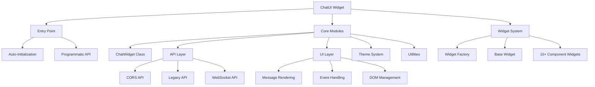

# ChatUI Widget Overview

ChatUI is a professional, ultra-lightweight (~12KB) chat UI widget built with pure Vanilla JavaScript. It provides a modern conversational interface without framework dependencies or technical complexity.

## Strategic Position

ChatUI delivers interactive chat capabilities with minimal performance overhead, designed to be "live in 30 seconds" while remaining extensible for enterprise requirements.

## Key Features

- **Ultra-Lightweight**: ~12KB core footprint
- **Zero Dependencies**: Pure vanilla JavaScript
- **Framework Agnostic**: Works with any web stack
- **CORS-First Communication**: Modern fetch API with JSONP fallback
- **Real-Time Support**: WebSocket integration for live features
- **Dual Modes**: Popup and fullpage embedding
- **Interactive Widgets**: 15+ specialized UI components
- **Accessible**: ARIA-compliant focus management
- **Secure**: XSS prevention and scoped CSS

## Target Markets

- **SMBs**: Professional chat with zero dev overhead
- **Enterprise Legacy Systems**: Modern UI without framework migrations
- **SaaS Platforms**: White-label frontend for proprietary backends

## Architecture Overview



## Module Structure

The widget is organized into logical modules:

- **Entry Point**: Auto-initialization and global API
- **Core Classes**: Main ChatWidget implementation
- **API Layer**: Transport abstraction (CORS/JSONP/WebSocket)
- **UI Layer**: DOM manipulation and event handling
- **Theme System**: Styling and customization
- **Widget System**: Interactive component framework
- **Utilities**: Helper functions and shared utilities

## Communication Protocols

ChatUI supports multiple transport protocols with automatic fallback:

1. **WebSocket** (ws/wss): Real-time bidirectional communication
2. **CORS** (http/https): Modern fetch-based API calls
3. **JSONP** (http/https): Legacy fallback for older servers

## Integration Patterns

### HTML Integration
```html
<script 
  id="chat-widget"
  src="path/to/chat-widget.js"
  data-server-url="https://your-server.com"
  data-position="bottom-right"
  data-color="#007bff"
  data-title="Chat with us">
</script>
```

### Programmatic API
```javascript
const chat = ChatUI.init({
  id: 'custom-chat',
  title: 'Support Chat',
  color: '#28a745',
  position: 'bottom-left',
  serverUrl: 'http://localhost:3000'
});
```

## See Also

- [Getting Started](getting_started.md) - Quick setup guide
- [Architecture](architecture.md) - Detailed system design
- [API Reference](api_reference.md) - Complete API documentation
- [Configuration](configuration.md) - All configuration options
